# MEDRES ODK Collect

> **Version**: v2026.1.2-MEDRES-RC2 | **Status**: Release Candidate
> **Upstream**: ODK Collect v2026.1.2 (March 2026)

## Overview

MEDRES ODK Collect is a specialized fork of ODK Collect transformed into a secure, institutional-grade data collection tool. It introduces a modular authentication system, security PINs, and intelligent data isolation for shared-device environments.

## Core Features

### Advanced Authentication
The application replaces the ultra long lived token  with a short validity token based system. This includes a user initiated re-authentication flow with notifications and reminders as well as a grace period concept to ensure work in field does not suffer. The token valdiity is configurable on a per project basis from the similary forked ODK central server.

### User Experience and Security
The application leverages the specialized UI for authentication and security workflows.

### Security and Privacy
*   **Session Lock**: Immediate app lock on backgrounding.
*   **Encrypted Storage**: Credentials and tokens are stored in secure, encrypted preferences.
*   **Brute Force Protection**: Automatic session wipe after three failed PIN attempts.

### Offline Resilience
Designed for low-connectivity environments, the app includes an offline grace period and intelligent server reachability checks to ensure field workers can continue their tasks uninterrupted.

## Behavioral Flows

### 1. User Journey (Auth & PIN Setup)
The high-level journey for a mobile user from first launch to active use.

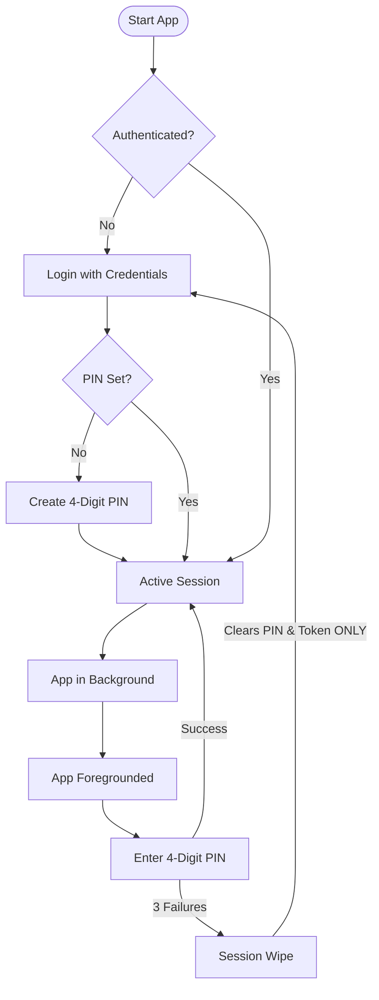
```mermaid
flowchart TD
    Start([Start App]) --> Access{Authenticated?}
    
    Access -- No --> Login[Login with Credentials]
    Login --> PINSetup{PIN Set?}
    
    PINSetup -- No --> CreatePIN[Create 4-Digit PIN]
    CreatePIN --> Active[Active Session]
    
    PINSetup -- Yes --> Active
    Access -- Yes --> Active
    
    Active --> Background[App in Background]
    Background --> Foreground[App Foregrounded]
    Foreground --> PINEntry[Enter 4-Digit PIN]
    
    PINEntry -- Success --> Active
    PINEntry -- 3 Failures --> Wipe[Session Wipe]
    Wipe -->|Clears PIN & Token ONLY| Login
```

### 2. Security & Session Lifecycle
The background logic managing token longevity, proactive reminders, and hardware integrity.

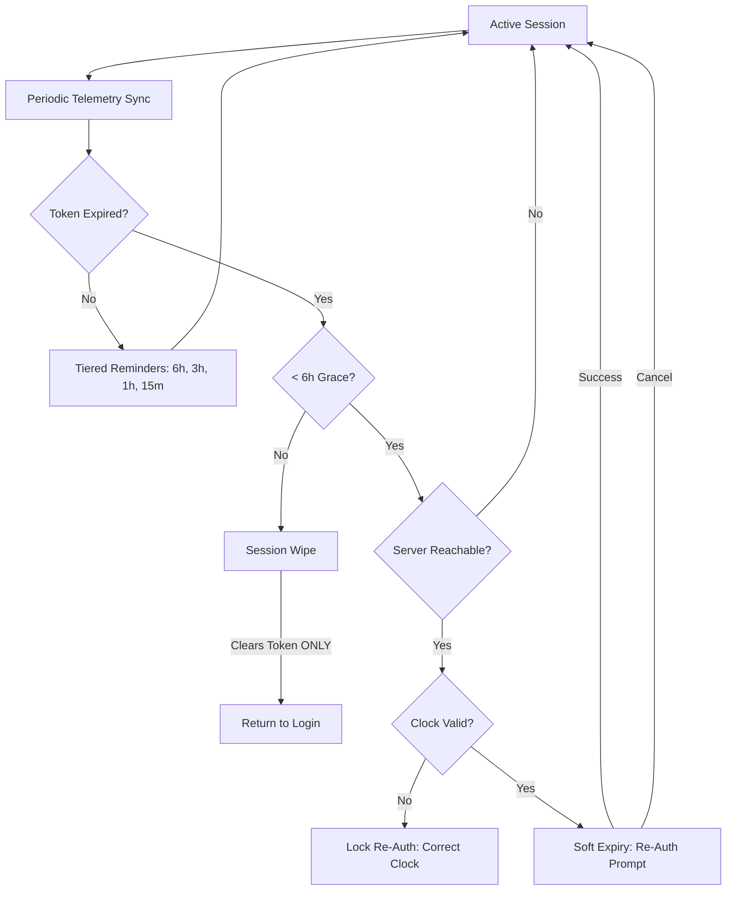
```mermaid
flowchart TD
    Active[Active Session] --> Telemetry[Periodic Telemetry Sync]
    Telemetry --> ExpiryCheck{Token Expired?}
    
    ExpiryCheck -- No --> Reminders[Tiered Reminders: 6h, 3h, 1h, 15m]
    Reminders --> Active

    ExpiryCheck -- Yes --> GraceCheck{< 6h Grace?}
    
    GraceCheck -- No --> Wipe[Session Wipe]
    Wipe -->|Clears Token ONLY| Login[Return to Login]
    
    GraceCheck -- Yes --> Reachable{Server Reachable?}
    Reachable -- No --> Active
    Reachable -- Yes --> ClockCheck{Clock Valid?}
    
    ClockCheck -- No --> Locked[Lock Re-Auth: Correct Clock]
    ClockCheck -- Yes --> SoftExpiry[Soft Expiry: Re-Auth Prompt]
    
    SoftExpiry -- Success --> Active
    SoftExpiry -- Cancel --> Active
```

### High-Level Features
- **Advanced Authentication**: Short-validity tokens, QR based configuration, and manual/auto re-authentication flows.
- **Offline Telemetry**: Reliable capture of security and health events with [Room DB queuing and background sync](docs/medres-custom/05-FEATURES/telemetry-system.md).
- **Grace-Period Security**: 6-hour offline tolerance with [Clock Drift Detection](docs/medres-custom/05-FEATURES/security-scenarios.md).
- **Lifecycle Protection**: Instant [PIN/Login App-Lock](docs/medres-custom/05-FEATURES/app-lifecycle-security.md) when backgrounded.
- **Shared-Device continuity**: [Preserves all form drafts](docs/medres-custom/05-FEATURES/shared-device-continuity.md) while strictly isolating user tokens and PINs.
- **Diagnostics**: Secure, [encrypted log export](docs/medres-custom/05-FEATURES/logging-diagnostics.md) for remote field support.
- **Accessibility**: Full [WCAG 2.1 Level AA compliance](docs/medres-custom/05-FEATURES/accessibility.md) for re-auth and security screens.

### Security Resilience
The application is hardened against common exploit vectors:
- **PIN Bypass Protection**: Mandatory re-auth on cold starts or background resume.
- **Shared-Device Isolation**: Automatic PIN clearance on user change.
- **System Resilience**: Fail-safe logout fallbacks for storage corruption or network races.
- **API Guard**: Mutex-based sync for concurrent operations and rate limiting for auth calls.

For a full catalog of protected scenarios, see [Security Scenarios & Resilience](docs/medres-custom/05-FEATURES/security-scenarios.md).

## Technical Architecture

The architecture is built on a clean separation between the MEDRES Auth Module and the ODK Core.

| Component | Responsibility |
|-----------|---------------|
| MEDRES Auth Module | Handles login, token management, and security lifecycle. |
| ODK Core | Manages form rendering, logic, and data storage. |

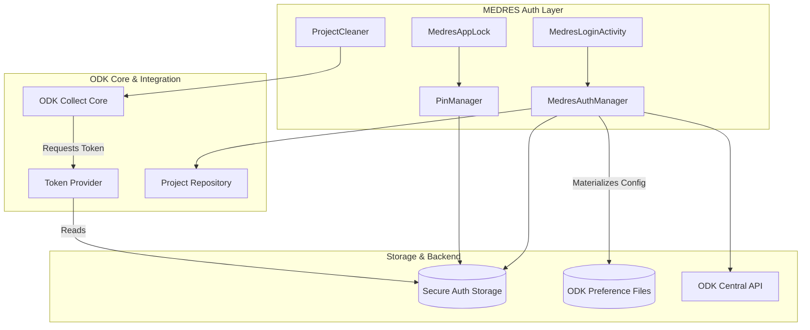
```mermaid
graph TB
    subgraph "MEDRES Auth Layer"
        AuthUI[MedresLoginActivity]
        AuthMgr[MedresAuthManager]
        AppLock[MedresAppLock]
        PinMgr[PinManager]
        Cleaner[ProjectCleaner]
    end

    subgraph "ODK Core & Integration"
        TokenProvider[Token Provider]
        ODKCore[ODK Collect Core]
        Projects[Project Repository]
    end

    subgraph "Storage & Backend"
        SecureStorage[(Secure Auth Storage)]
        ODKStorage[(ODK Preference Files)]
        Central[ODK Central API]
    end

    AuthUI --> AuthMgr
    AuthMgr --> SecureStorage
    AuthMgr --> Projects
    AuthMgr --> Central
    
    AppLock --> PinMgr
    PinMgr --> SecureStorage
    
    Cleaner --> ODKCore
    
    ODKCore -- Requests Token --> TokenProvider
    TokenProvider -- Reads --> SecureStorage
    
    AuthMgr -- "Materializes Config" --> ODKStorage
```

## Documentation

For detailed technical specifications and maintenance guides, refer to the following:

1.  **[Quickstart Guide](docs/medres-custom/01-QUICKSTART.md)**: Getting started with the MEDRES flavor.
2.  **[Architecture Overview](docs/medres-custom/01-ARCHITECTURE/overview.md)**: Unified technical documentation and system flows.
3.  **[API Specification](docs/medres-custom/03-API/reference.md)**: Backend endpoint definitions for the Customized ODK Central API.
4.  **[Maintenance Guide](docs/medres-custom/04-OPERATIONS/maintenance.md)**: Instructions for merging upstream changes.
5.  **[Versioning Strategy](docs/medres-custom/04-OPERATIONS/versioning.md)**: Release candidate workflow and versioning rules.
6.  **[QR Codes Reference](docs/medres-custom/01-ARCHITECTURE/qr-codes.md)**: QR types, detection rules, and security boundaries.
7.  **[Scanning Draft QRs](docs/medres-custom/01-ARCHITECTURE/scanning-draft-form-QRs.md)**: Draft Testing Mode workflow.

## Technical Specifications

| Requirement | Specification |
| :--- | :--- |
| **Minimum OS** | Android 10 (API 29) |
| **Target OS** | Android 15 (API 35) |
| **Build SDK** | API 36 |
| **Architecture** | ARM/x86 (64-bit optimized) |
| **Permissions** | Location, Camera, Notifications, Storage |

## Credits
Based on the official [ODK Collect](https://github.com/getodk/collect) project.

## Screenshots & Workflows

A visual walk-through of the MEDRES ODK Collect authentication and security experience.

### 00. Login Screen
Central authentication portal for MEDRES users requiring project-specific credentials.

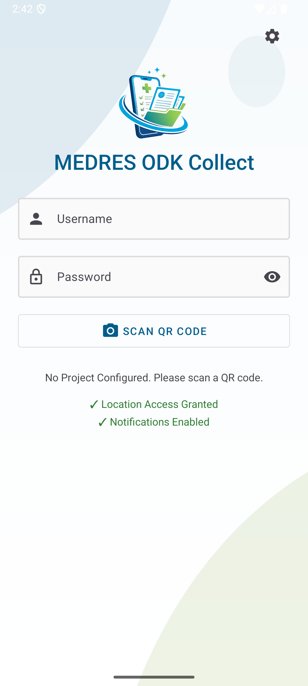

### 01. & 02. Project Configuration
Support for both manual URL entry and rapid, standardized QR code configuration.

  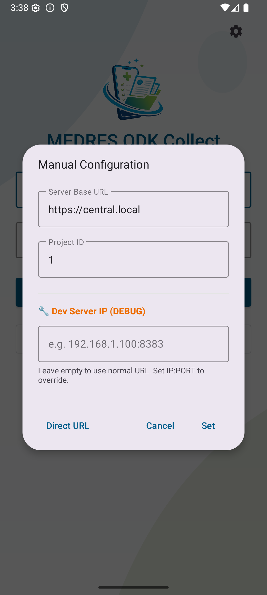
  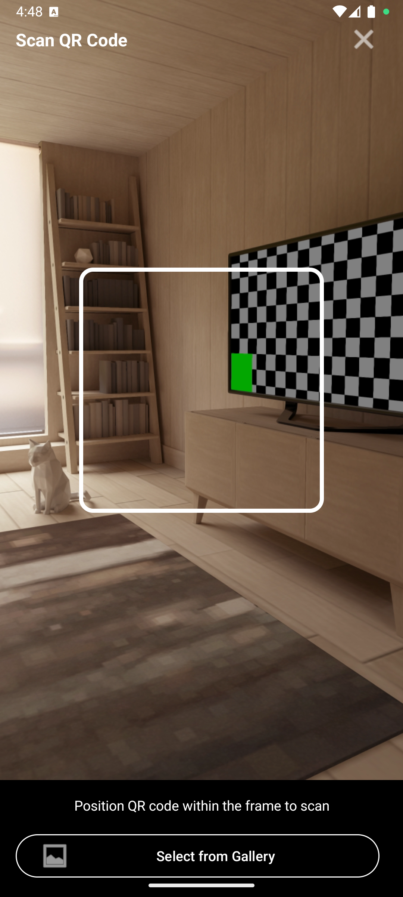

### 03. PIN Setup
Initial creation of the mandatory 4-digit security PIN for local session locking.

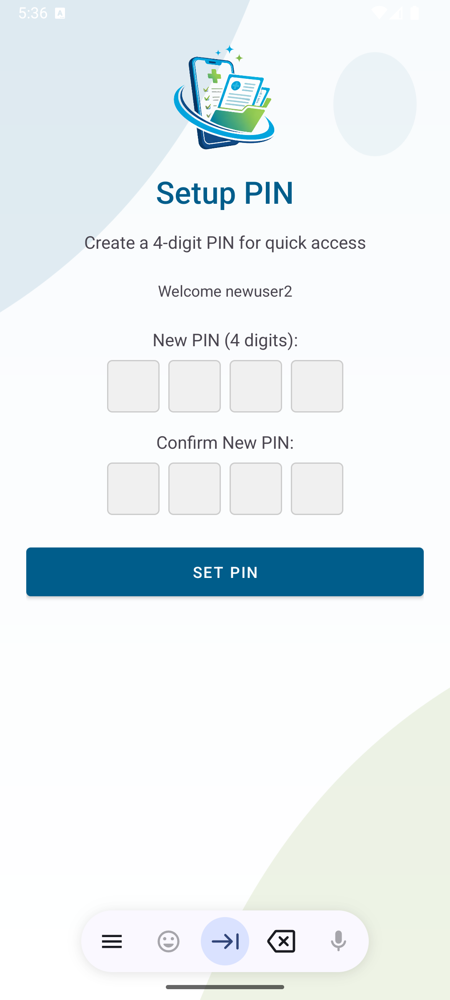

### 04. & 05. Authenticated Home & Settings
Updated home screen and accessible security settings following a successful login.

  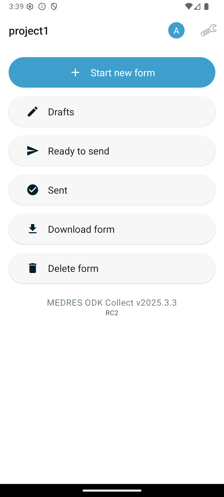
  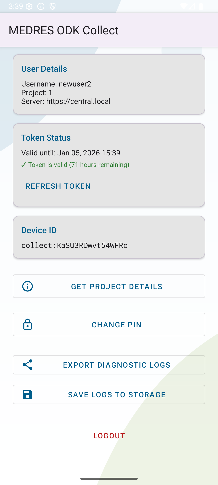

### 05b. Project Isolation
Project switching is restricted to maintain strict data boundaries and security.

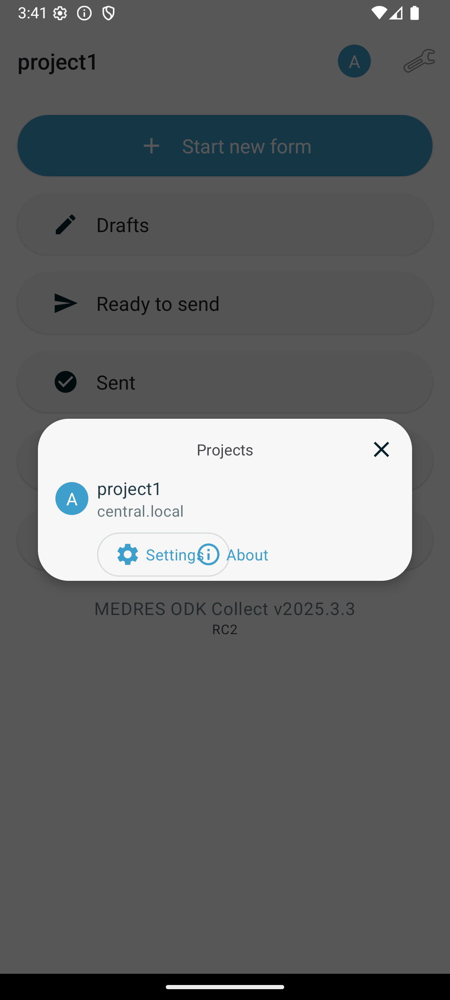

### 06. Session Lock
The app automatically locks and requires PIN re-entry when resumed from the background.

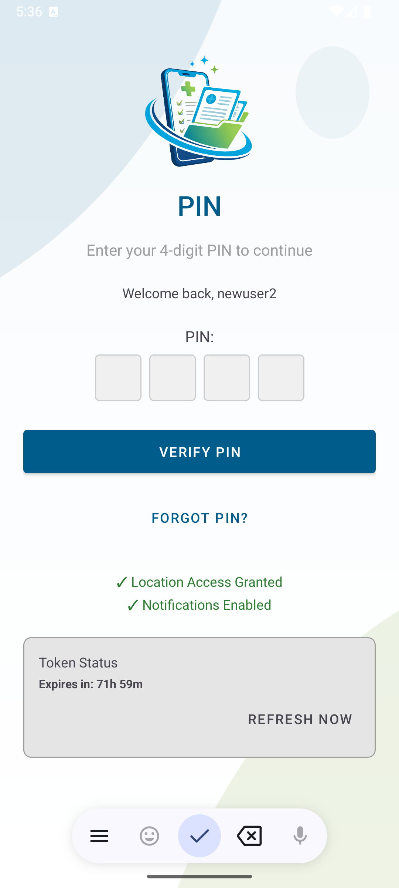

### 07. Token Management
Options for seamless background re-authentication or manual token renewal.

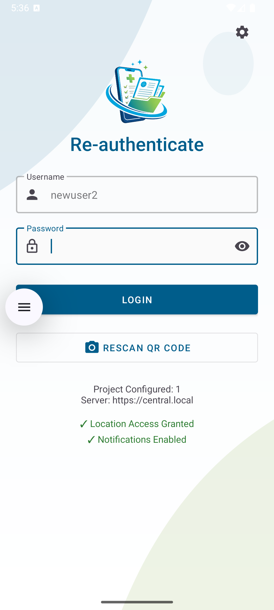

### 08. Clock Drift Validation
Advanced security check validating device time against the server to prevent grace-period exploits.

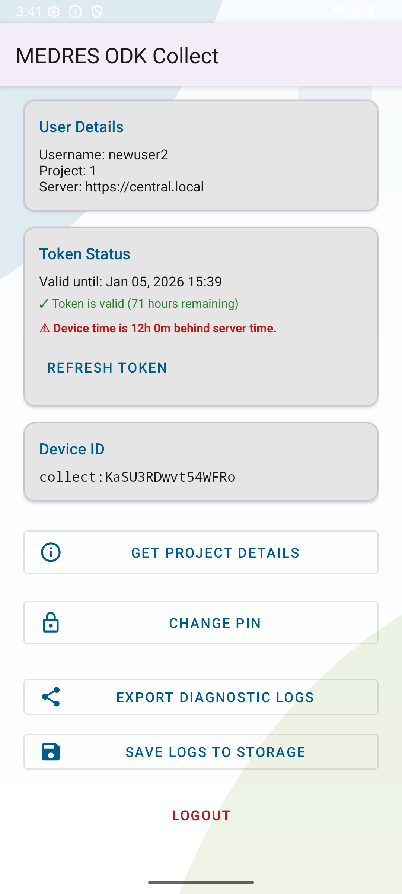

### 09. & 10. Logging & Diagnostics
Built-in utilities for exporting and securely saving encrypted logs for remote troubleshooting.

  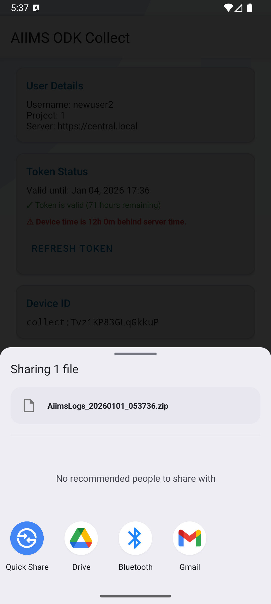
  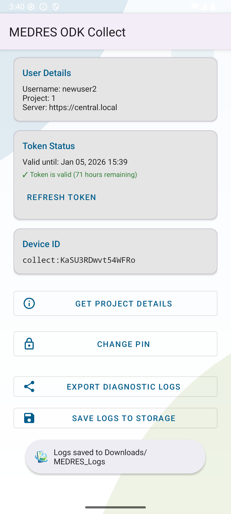

### 11. Permissions Audit
Automated system providing a clear overview of mandatory permissions needed for operation.

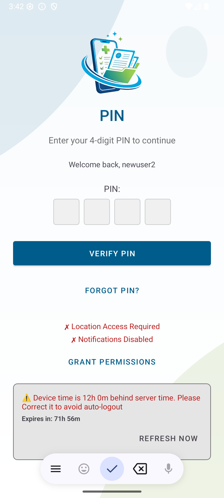

## QR Workflow Notes

- **MEDRES Project QR**: stages project metadata and returns the user to login.
- **Draft QR**: enters **Draft Testing Mode** without username/password login.
- **Standard ODK Managed QR**: rejected to avoid overwriting MEDRES configuration.
- Draft QR `project.name` is treated as display-only draft form metadata, not as the persistent production project name.

---

## Backend (ODK Central) Customizations
The MEDRES fork includes a heavily modified ODK Central backend to support advanced authentication, telemetry mapping, and per-project security policies.

### B1. App User Management
Automated password generation and centralized project-access control for field workers.

  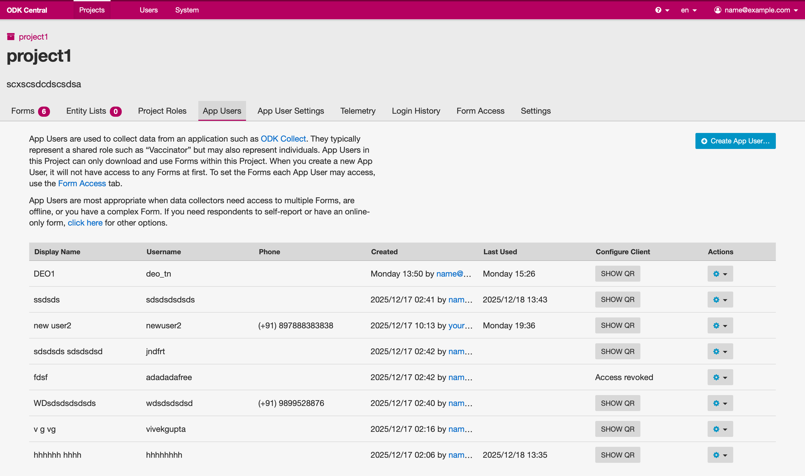
  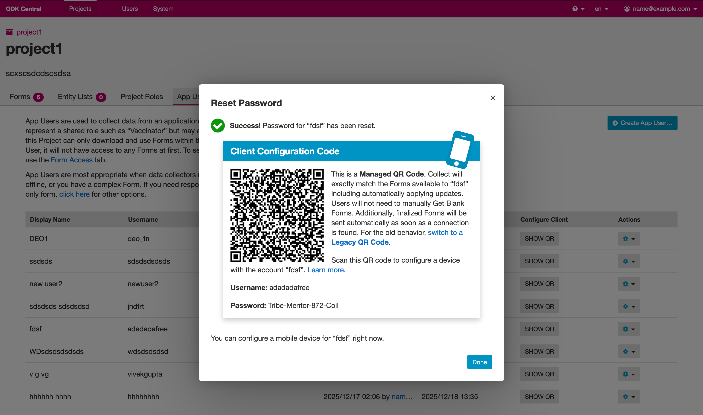

### B2. Security Policies
Project-specific security constraints, including mandatory PIN rotation and session timeout rules.
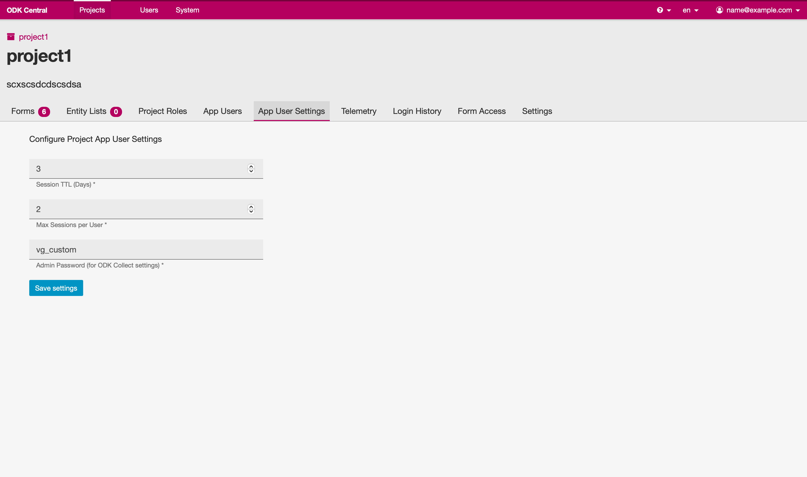

### B3. Telemetry & Live Mapping
Real-time geographic visualization of field worker health, battery status, and security events.
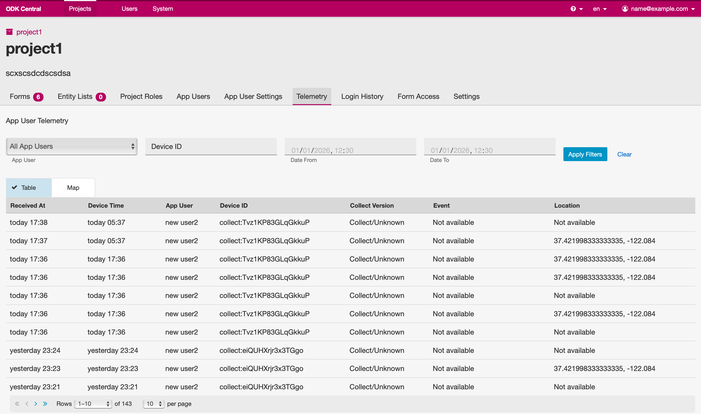
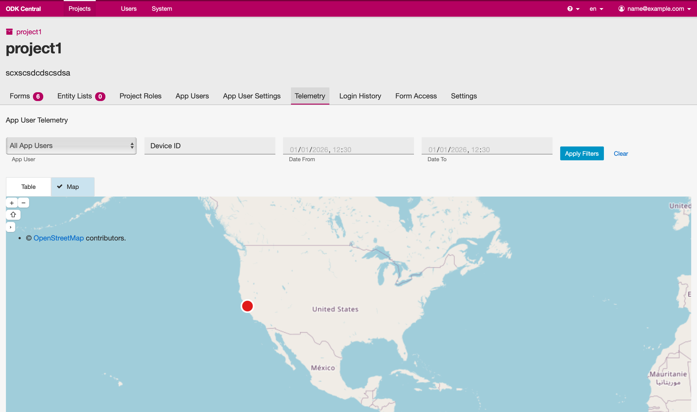

### B4. Audit Logs
Detailed login history and security audit trails synchronized from mobile devices.
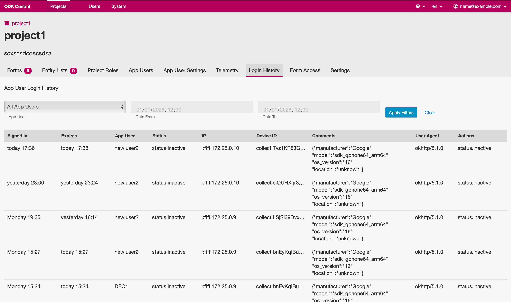
