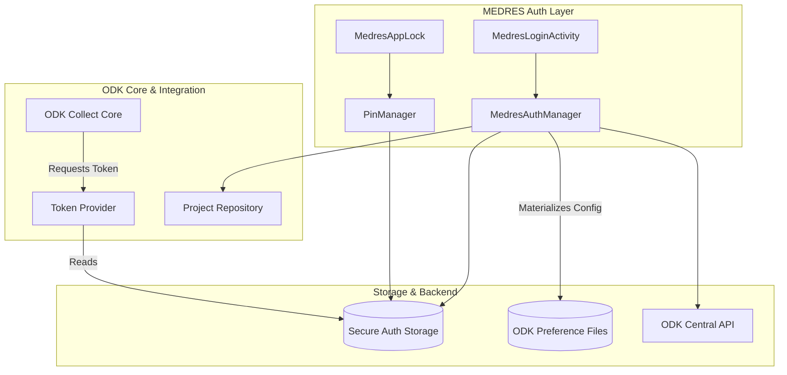

# MEDRES ODK Collect

> **Version**: v2026.1.2-MEDRES-RC1 | **Status**: Release Candidate  
> **Upstream**: ODK Collect v2026.1.2

## Overview

MEDRES ODK Collect is a secure, institutional-grade fork of ODK Collect designed for field medical research in resource-constrained environments. It introduces Bearer Token authentication, mandatory PIN security, intelligent QR workflows, and offline resilience for shared-device deployments.

## Key Features

- **Bearer Token Authentication**: Short-lived tokens (3-day validity) with server-side revocation and 6-hour offline grace period
- **PIN Security**: Mandatory 4-digit PIN with 3-attempt wipe, hardware-backed encryption (AES-256-GCM)
- **Intelligent QR Workflows**: Automatic detection of Project QRs (production) vs. Draft QRs (testing) with 5-layer security validation
- **Offline Resilience**: 6-hour grace period, intelligent server reachability checks, offline telemetry queuing
- **Shared Device Support**: Forms wiped on logout, instances preserved, user-level PIN isolation
- **Comprehensive Telemetry**: 20-minute heartbeat with location, battery, security events
- **WCAG 2.1 Level AA**: Full accessibility compliance for authentication flows

## User Journey

## Technical Architecture

## Security Hardening

- **QR Security**: 5-layer validation prevents decompression bombs, key injection, credential theft
- **PIN Bypass Protection**: Mandatory re-auth on cold starts and background resume
- **Shared-Device Isolation**: Automatic PIN clearance on user change
- **Brute Force Protection**: 3 failed PIN attempts trigger immediate session wipe
- **Clock Manipulation Detection**: Prevents grace period exploits via device time changes
- **Encrypted Storage**: Hardware-backed AES-256-GCM for tokens, pins, and credentials
- **API Guard**: Mutex-based sync for concurrent operations, rate limiting for auth calls

Full details: [Security Scenarios & Resilience](docs/medres-custom/05-FEATURES/security-scenarios.md)

## Documentation

### Core Documentation
1. **[Quickstart Guide](docs/medres-custom/01-QUICKSTART.md)** - Getting started with MEDRES
2. **[Architecture Overview](docs/medres-custom/01-ARCHITECTURE/overview.md)** - Technical documentation and system flows
3. **[API Specification](docs/medres-custom/03-API/reference.md)** - Backend endpoint definitions
4. **[Maintenance Guide](docs/medres-custom/04-OPERATIONS/maintenance.md)** - Merging upstream changes
5. **[Versioning Strategy](docs/medres-custom/04-OPERATIONS/versioning.md)** - Release candidate workflow

### QR Code Workflows
6. **[QR Codes Reference](docs/medres-custom/01-ARCHITECTURE/qr-codes.md)** - QR types, detection logic, and security
7. **[Scanning Draft QRs](docs/medres-custom/01-ARCHITECTURE/scanning-draft-form-QRs.md)** - Testing draft forms in Demo Mode

### Operations & Security
8. **[Release Signing Guide](docs/medres-custom/04-OPERATIONS/release-signing.md)** - Production release procedures
9. **[Building Guide](docs/medres-custom/02-DEVELOPMENT/building.md)** - Build workflows for all flavors
10. **[CHANGELOG](docs/CHANGELOG.md)** - Version history and release notes

## Technical Specifications

| Requirement | Specification |
| :--- | :--- |
| **Minimum OS** | Android 10 (API 29) |
| **Target OS** | Android 15 (API 35) |
| **Build SDK** | API 36 |
| **Architecture** | ARM/x86 (64-bit optimized) |
| **Permissions** | Location, Camera, Notifications, Storage |

## Backend (ODK Central)

MEDRES requires a heavily modified ODK Central backend with:
- Bearer Token authentication (3-day JWT tokens, configurable per-project)
- Telemetry endpoint (receives device location, battery, security events)
- App user management (automated password generation)
- Project-specific security policies (token validity, grace periods, PIN rotation)
- Audit logs (login history, security events)

Backend Documentation: [ODK Central Docs](docs/medres-custom/ODK_Central_docs/)

## Screenshots

Click to view authentication and security workflows

### Login & Configuration

  
  
  

### PIN Setup & Security

  
  
  

### Authenticated Session

  
  
  

### Diagnostics & Permissions

  
  
  

### Backend Screenshots

## What's New in RC4

### Intelligent QR Code Detection
Automatic QR type detection separates production data collection from form testing:

- **Project QRs**: Trigger login flow for production data collection
- **Draft QRs**: Enter Demo Mode for testing form updates
- **Standard ODK QRs**: Rejected with error messages (incompatible with MEDRES auth)
- **Legacy ODK QRs**: Blocked to prevent security bypass

This prevents data contamination and configuration errors.

### 5-Layer QR Security Validation
1. **Size Limits**: Max 4KB compressed, 16KB decompressed (prevents decompression bombs)
2. **Key Validation**: Settings validated against `ProjectKeys` whitelist (prevents injection)
3. **Type Safety**: Boolean/String/Integer type checking (prevents type confusion)
4. **Sensitive Key Protection**: Blocks `server_url`, `username`, `password` override (prevents credential theft)
5. **Demo Mode Validation**: Draft QRs require both `/draft` and `/test/` in URL

### Automatic Project Name Updates
Project names update automatically after authentication.

## Credits

Based on the official [ODK Collect](https://github.com/getodk/collect) project.
