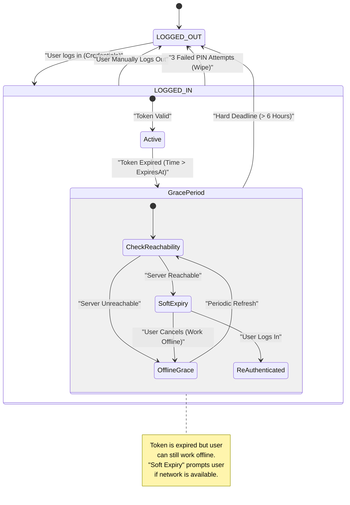
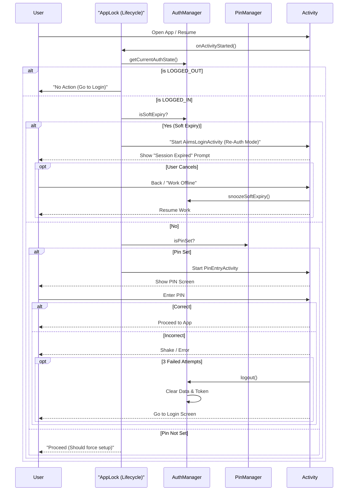

# AIIMS ODK Collect: Architecture & Flows

This document visualizes the custom Authentication, Security, and Data Isolation flows implemented in the AIIMS fork of ODK Collect.

## 1. Authentication Lifecycle (State Machine)
The core logic resides in `AiimsAuthManager`. It handles JWT Bearer tokens, Expiry, and the 6-Hour Offline Grace Period.



## 2. Startup & PIN Security Flow
`AiimsAppLock` intercepts Activity lifecycles to enforce PIN security when the app comes to the foreground.



## 3. Data Stores & Isolation
We strictly isolate project data. When a user logs out (or session executes Hard Logout), we wipe sensitive data.

```mermaid
graph TD
    subgraph "SharedPreferences (Secure)"
        AuthPrefs[("aiims_auth_prefs")]
        MetaPrefs[("meta_prefs")]
        
        AuthPrefs -->|Contains| Token["JWT Token"]
        AuthPrefs -->|Contains| User["User Profile"]
        AuthPrefs -->|Contains| Expiry["Expiry Timestamp"]
    end
    
    subgraph "ODK Internal Storage"
        FormsDB[("Forms Database (SQLite)")]
        InstancesDB[("Instances Database (SQLite)")]
        FormFiles[("Form Files (XML/Media)")]
        InstanceFiles[("Instance XMLs")]
    end
    
    subgraph "Managers"
        AuthMgr[AiimsAuthManager]
        ProjCleaner[ProjectCleaner]
    end
    
    AuthMgr -- Read/Write --> AuthPrefs
    
    AuthMgr -- On Logout --> ProjCleaner
    
    ProjCleaner -- Wipes --> FormsDB
    ProjCleaner -- Wipes --> FormFiles
    
    note right of ProjCleaner
        "Blank Forms" are deleted to prevent new users from seeing previous project forms. Completed Instances are KEPT for sync."
    end note
```
