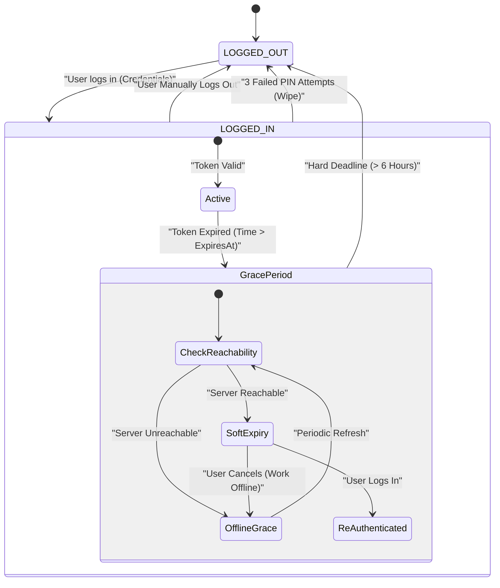
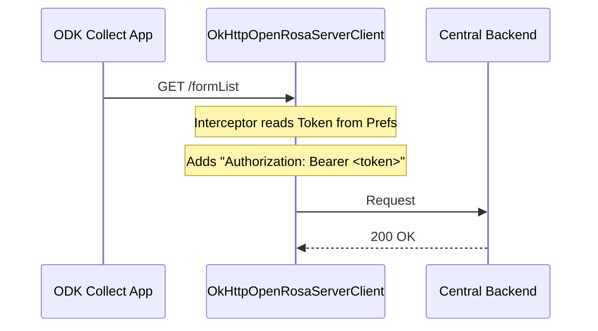

# AIIMS ODK Collect Customization - Project Knowledge

## 1. Project Overview
This project modifies the standard ODK Collect Android application to support a custom authentication and security workflow required by AIIMS/VG. The core modifications replace the standard ODK user management with a Project-based App User system involving short-lived bearer tokens, PIN security, and strict data isolation.

## 2. Key Features

### 🔐 Custom Authentication (Bearer Token)
*   **Mechanism**: Replaces Basic Auth with **Bearer Token** authentication.
*   **Token Lifecycle**: Short-lived tokens (default 3 days).
*   **Flow**:
    1.  User logs in with `username` / `password`.
    2.  Server returns a JWT `token`.
    3.  App injects `Authorization: Bearer <token>` into all OpenRosa requests via a custom `OkHttp Interceptor`.
    4.  **Grace Period**: 6-hour offline grace period after expiry.

### 🛡️ PIN Security
*   **Enforcement**: Use `AiimsAppLock` to enforce PIN entry on app resume.
*   **Storage**: Securely stored in `PinManager`.
*   **Policy**:
    *   Mandatory setup immediately after login.
    *   **Wipe on Failure**: 3 failed PIN attempts triggers an immediate **Logout**, wiping all project data.
    *   **Re-Login Safety**: If a new user logs in, the old PIN is cleared.

### 📶 Networking Enhancements
*   **Local Dev Support**: Automatically maps `central.local` to `10.0.2.2` in Debug builds.
*   **SSL Bypass**: Trusts all certificates in Debug builds to facilitate local development.

### 🧹 Data Isolation & Retention
*   **Blank Forms**: Deleted on logout (`ProjectCleaner`). Ensures new users can't see old forms.
*   **Instances (Filled Forms)**: **Retained** on logout. Allows multiple users to collect data on the same device and upload to the same project.
*   **Secure Storage**: Tokens and User profiles stored in `aiims_auth_prefs` (separate from standard ODK prefs).

## 3. Architecture & Flows

### Authentication State Machine

### Network Injection Flow

## 4. API Reference
Based on `docs/AIIMS_API.md`.

| Endpoint | Method | Description | Auth |
| :--- | :--- | :--- | :--- |
| `/projects/:id/app-users/login` | POST | Login to get Bearer Token. | Anonymous |
| `/projects/:id/app-users` | POST | Create a new App User. | Admin |
| `/projects/:id/app-users` | GET | List App Users (`token` is null). | Admin |
| `/projects/:id/app-users/:uid` | PATCH | Update App User details. | Admin |
| `/projects/:id/app-users/:uid/password/change` | POST | Change own password. | User Token |
| `/projects/:id/app-users/:uid/revoke` | POST | Revoke current user session. | User Token |
| `/system/settings` | GET | Get system settings (TTL, Cap). | Admin |

## 5. Critical Code Components

*   `AiimsAuthManager`: Central hub for Auth state, login/logout logic, and token retrieval.
*   `AiimsAppLock`: Handles Activity lifecycle to display PIN screen when app comes to foreground.
*   `ProjectCleaner`: Handles secure deletion of forms (but not instances) upon logout.
*   `OkHttpOpenRosaServerClientProvider`: Where the custom `TokenProvider` and Local DNS logic are injected into the ODK Core networking stack.
*   `AiimsConstants`: (Being deprecated/refactored) - central place for keys, moving towards specific Managers.
