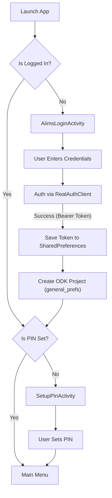
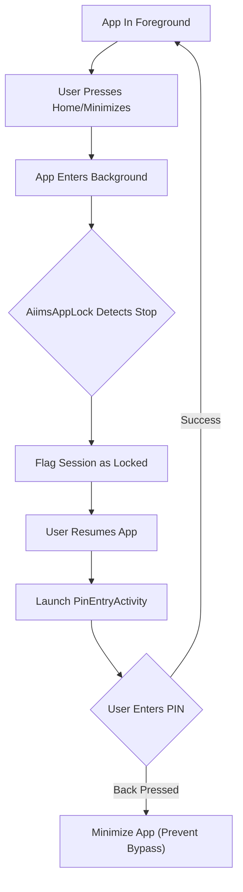
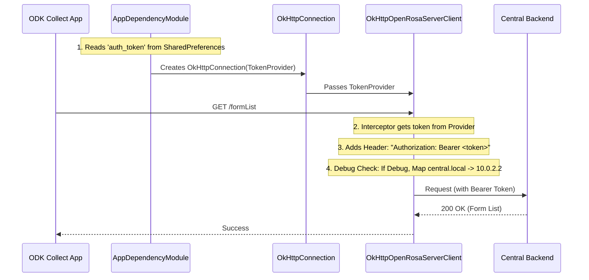

# System Changes & Architecture Documentation
**Date**: 2025-12-18
**Objective**: Enable App User Authentication, Local Development Networking, and Secure PIN Access in ODK Collect.

## 1. Executive Summary
This document details the modifications made to the ODK Collect codebase to support:
1.  **Custom Authentication**: Replaces standard ODK Auth with a Bearer Token system (short-lived tokens).
2.  **Local Networking**: Enables the Android Emulator to resolve `central.local` to `10.0.2.2` with SSL bypass (Debug builds only).
3.  **PIN Security**: Enforces a local PIN setup workflow immediately after login.
4.  **Project Persistence**: Fixes manual project configuration to correctly persist settings using ODK's internal preference schemas.

---

## 2. Process Flows

### A. Authentication & Login Flow
The login process has been intercepted to Authenticate against a custom backend, save the token, and enforce PIN setup.



### B. PIN Security & App Resume Flow
The app monitors its foreground state to lock the session when minimized.


```

### B. Network Request Flow (Token Injection)
Standard ODK requests (OpenRosa) used to fail because they didn't know about our custom Bearer Token. We injected a `TokenProvider` into the core network stack.



---

## 3. Detailed Change Log (File by File)

### Core Networking & Security

#### `collect_app/.../AppDependencyModule.java`
*   **Change**: Updated `provideHttpInterface` to instantiate `OkHttpConnection` with extra arguments.
*   **Why**: To inject dependencies that `OkHttpConnection` now requires.
*   **Details**:
    *   Passes `BuildConfig.DEBUG` (to enable/disable hacks safely).
    *   **New implementation**: Creates an anonymous `TokenProvider` that reads the active auth token from `aiims_auth_prefs`.

#### `open-rosa/.../OkHttpConnection.java`
*   **Change**: Updated constructor signature.
*   **Why**: To bridge the Dependency Module and the Client Provider.
*   **Details**: Accepts `boolean isDebug` and `TokenProvider tokenProvider` and passes them to `OkHttpOpenRosaServerClientProvider`.

#### `open-rosa/.../OkHttpOpenRosaServerClientProvider.java`
*   **Change**: Major networking logic overhaul.
*   **Why**: To handle Local DNS, SSL errors, and Custom Auth.
*   **Details**:
    *   **Custom DNS**: If `isDebug` is true, maps `central.local` -> `10.0.2.2`.
    *   **Unsafe SSL**: If `isDebug` is true, trusts all certificates (fixes "Cert Path Validator Exception" for local dev).
    *   **Token Injection**: Added an OkHttp Interceptor. If `TokenProvider.getToken()` returns a value, it adds `Authorization: Bearer <token>` to **every** request. This fixes the "401 Unauthorized" error on form lists.

#### `open-rosa/.../TokenProvider.java` (NEW)
*   **Change**: Created new interface.
*   **Why**: Decouple `open-rosa` module from Android `SharedPreferences`. `open-rosa` defines the interface; `collect_app` implements it.

---

### Authentication UI & Logic

#### `aiims_auth_module/src/main/java/org/aiims/odk/auth/activities/AiimsLoginActivity.kt`
*   **Change**: UI updates and Flow Control.
*   **Why**: Improve UX, enforce business rules, and fix persistence.
*   **Details**:
    *   **Manual Config UI**: Split "URL" input to allow separate Base URL (`https://central.local`) and Project ID (`1`).
    *   **Persistence Fix**: Changed preference file from `org.odk.collect.android_preferences_<uuid>` to `general_prefs<uuid>`. This ensures ODK actually *sees* the saved URL.
    *   **PIN Check**: In `attemptLogin` (on success), added check `PinManager.isPinSet()`. Redirects to `SetupPinActivity` if false.

#### `aiims_auth_module/src/main/java/org/aiims/odk/auth/managers/AiimsAuthManager.kt`
*   **Change**: Added `getActiveProjectToken()`.
*   **Why**: `AuthSettingsActivity` needed a way to show the token to the user for debugging.
*   **Details**: Provides the Bearer token for the currently active project ID.

#### `aiims_auth_module/src/main/java/org/aiims/odk/auth/activities/AuthSettingsActivity.kt`
*   **Change**: Display actual token.
*   **Why**: Verification. User can now see if they are logged in and what valid token they hold.
*   **Details**: Fetches token via `AiimsAuthManager` and displays it in the UI.

#### `aiims_auth_module/src/main/java/org/aiims/odk/auth/api/RealAuthClient.kt`
*   **Change**: Updated `NetworkUtils` configuration.
*   **Why**: Ensure the *Login* request (which happens before Core ODK takes over) also respects `central.local` and unsafe SSL.
*   **Details**: Implements the same DNS and Trust-All-Certs logic for the Retrofit client used during the initial login phase.

#### `aiims_auth_module/build.gradle`
*   **Change**: Added dependencies.
*   **Why**: To support new features like Biometrics and JWT handling.
*   **Details**:
    *   Added `com.auth0.android:jwtdecode:2.0.1` for token parsing.
    *   Added `androidx.biometric:biometric:1.1.0` for future biometric auth support.
    *   Added `:projects` and `:settings` module dependencies to interact with ODK core.

#### `aiims_auth_module/src/main/java/org/aiims/odk/auth/api/AuthApiService.kt`
*   **Change**: Defined API endpoints.
*   **Why**: To communicate with the custom backend.
*   **Details**:
    *   `login`: POST `/projects/{projectId}/app-users/login` (Authentication).
    *   `revokeSession`: POST `/projects/{projectId}/app-users/{id}/revoke` (Session termination).

#### `aiims_auth_module/src/main/java/org/aiims/odk/auth/api/User.kt`
*   **Change**: API Model updates.
*   **Why**: To match the backend response structure.
*   **Details**: Added `expiresAt`, `projectId` fields to the `User` data class to handle the login response parsing.

#### `aiims_auth_module/src/main/java/org/aiims/odk/auth/utils/AiimsProjectUtils.kt` (NEW)
*   **Change**: Created Utility class.
*   **Why**: Helper for parsing ODK URLs.
*   **Details**: `getProjectIdFromUrl` extracts the Numeric Project ID from a full Server URL (e.g., `.../projects/5` -> `5`).

#### `aiims_auth_module/src/main/java/org/aiims/odk/auth/utils/TokenRevocationManager.kt`
*   **Change**: Utility for offline revocation.
*   **Why**: Handle session revocation when the device is offline.
*   **Details**:
    *   `markPending`: Saves revocation request to SharedPreferences if network is unavailable.
    *   `processPending`: Retries revocation when network becomes available.

#### `aiims_auth_module/src/main/java/org/aiims/odk/auth/utils/AiimsAppLock.kt` (Refactored)
*   **Change**: Implemented `ActivityLifecycleCallbacks`.
*   **Why**: To detect when the app moves to the background and require a PIN on resume.
*   **Details**:
    *   **Auto-Lock**: Tracks started activities. When count drops to 0 (Background), sets a flag.
    *   **Resume**: On next activity start (Foreground), if flag is set, checks `PinManager.isPinSet()` and launches `PinEntryActivity`.
    *   **Loop Prevention**: Ignores Auth activities (`LoginActivity`, `PinEntryActivity`) to prevent infinite locking loops.

#### `aiims_auth_module/src/main/java/org/aiims/odk/auth/activities/PinEntryActivity.kt`
*   **Change**: Overrode `onBackPressed`.
*   **Why**: Security. Prevents users from bypassing the PIN screen by pressing "Back".
*   **Details**: Calls `moveTaskToBack(true)` instead of `finish()`, minimizing the app while keeping the Lock Screen active.

#### `ui_dump.xml` (NEW)
*   **Change**: Debug Artifact.
*   **Why**: Generated during UI testing/debugging to inspect the view hierarchy. Can be ignored/deleted.

### Data Isolation & Cleanup (Logout)

#### `aiims_auth_module/src/main/java/org/aiims/odk/auth/managers/ProjectCleaner.kt` (NEW)
*   **Change**: New Interface.
*   **Why**: To abstract the cleanup logic so `AiimsAuthManager` doesn't depend on `collect_app` classes directly.

#### `collect_app/.../AppDependencyModule.java`
*   **Change**: Implemented `ProjectCleaner` (for `AiimsAuthManager`) and injected `FormsDataService`.
*   **Why**: To perform selective data cleanup on logout and refresh the UI state.
    *   **Selective Deletion**: Uses `ProjectResetter` with `RESET_FORMS` and `RESET_CACHE` to delete blank forms (isolating users), but specifically omits `RESET_INSTANCES`.
        *   **Preservation Policy**: Filled forms (instances) are kept on the device.
        *   **Workflow Consequence**: A form filled by User A can be uploaded by User B, provided User B has access to (and downloads) the same Form Definition. This enables multi-user collection/upload workflows on shared devices.
    *   **Cache Invalidation**: Triggers `formsDataService.refresh(projectId)` immediately after the reset. This invalidates the in-memory `AppState` (LiveData) which the UI observes, forcing it to reflect the empty form list instantly. Without this, the UI shows stale forms until a restart.
    *   **UUID Resolution (Critical Fix)**: Initially, `ProjectCleaner` received the "Central Project ID" (e.g., "1") which caused `ProjectResetter` to fail silently or crash because it couldn't find the directory. The implementation was updated to resolve the correct **ODK Project UUID** (e.g., `8a7b...`) from `ProjectsDataService.requireCurrentProject().getUuid()` before attempting cleanup.
    *   **Threading Fix**: The cleanup operation involves Database and File I/O, which triggered a `StrictMode` violation when run on the Main Thread. The logic was wrapped in `withContext(Dispatchers.IO)` to prevent crashes and ensure the deletion actually completes.

#### `collect_app/.../Collect.java`
*   **Change**: Initialized `AiimsAuthManager` with `projectCleaner()`.
*   **Why**: Wires the cleanup logic into the authentication lifecycle.

---

### Bug Fixes Detail (Post-Implementation)
**1. Persistent Blank Forms**
*   **Issue**: Forms were visible after logout despite `ProjectCleaner` logic.
*   **Root Cause 1**: `ProjectResetter` expects an ODK UUID, but was passed a Central ID.
*   **Root Cause 2**: `StrictMode` killed the cleanup thread because DB access occurred on Main Thread.
*   **Fix**:
    *   Resolved correct UUID: `projectsDataService.requireCurrentProject().getUuid()`.
    *   Moved execution to IO thread: `withContext(Dispatchers.IO)`.

**2. PIN Persistence**
*   **Issue**: PIN remained active after logout.
*   **Fix**: Explicitly called `PinManager.getInstance(context).clearPin()` in `logoutProject`.

---

**3. Release Build Login Crash ("Network Error")**
*   **Issue**: Release APK crashed on login with "Network error" and `ClassCastException: java.lang.Class cannot be cast to java.lang.reflect.ParameterizedType`.
*   **Root Cause 1**: `aiims_auth_module` lacked `consumer-rules.pro`, causing ProGuard/R8 to obfuscate data models (`User`, `LoginResponse`), breaking Gson deserialization.
*   **Root Cause 2**: R8 stripped generic type information from Kotlin Coroutines `suspend` function `Continuation` parameters (e.g., `Continuation<Response<LoginResponse>>` -> `Continuation`), causing Retrofit to crash when inspecting the return type.
*   **Fix**:
    *   Updated `collect_app/proguard-rules.txt` to explicitly keep:
        *   `org.aiims.odk.auth.api.**` (classes and members).
        *   `kotlin.coroutines.Continuation` (to preserve suspend function signatures).
        *   Retrofit/OkHttp classes and critical attributes (`Signature`, etc.).

---

**4. PIN Security Refinements**
*   **Re-Login Safety**:
    *   **Issue**: If a session expired, a *different* user could log in and inherit the *previous* user's PIN.
    *   **Fix**: Modified `AiimsAuthManager.login()` to compare `oldUser.id` vs `newUser.id`. If they differ, `PinManager.clearPin()` is called automatically.
*   **Max Attempts Policy**:
    *   **Prior Behavior**: 4th attempt triggered logout.
    *   **Refined Behavior**: On the **3rd failed attempt**, the app **immediately** wipes the Session and the PIN (`logoutDueToFailedPin`), forcing a full re-login. Comments in `PinEntryActivity` were fixed to reflect this "Wipe" behavior.

---

**5. Offline Grace Period & Intermittent Connectivity**
*   **Context**: App users may work in areas with spotty connectivity. A hard expiry verification prevents them from working even if the server is unreachable.
*   **Feature: 6-Hour Grace Period**:
    *   **Hard Deadline**: Tokens are valid for offline use for up to **6 hours** after official expiry.
    *   **After 6 Hours**: Immediate Hard Logout occurs regardless of connectivity.
*   **Behavior (Within 6 Hours)**:
    *   **Offline**: If server is unreachable, user remains `LOGGED_IN` (Silent Grace).
    *   **Online (Intermittent)**: If server is reachable, the app triggers a **Soft Expiry** prompt.
        *   **User Choice**: The user can "Login" to refresh, or "Cancel" (Work Offline) to use the remaining grace period.
        *   **Impact**: Prevents users from being stranded/locked out due to a fleeting network connection.
*   **Implementation**:
    *   `AiimsAuthManager.refreshState` checks `GRACE_PERIOD_MS` (6h) and sets `isSoftExpiry` flag.
    *   `AiimsAppLock` detects `isSoftExpiry` and launches `AiimsLoginActivity` in `Re-Auth Mode`.

---

## 5. Summary of Why
*   **Why did forms fail to download?**
    *   ODK default behavior uses Basic Auth (User/Pass). Your backend expects Bearer Token. We injected the Bearer token.
*   **Why didn't it connect to local?**
    *   Android Emulator needs `10.0.2.2`, not `localhost` or mDNS. We added a custom DNS resolver.
*   **Why did settings disappear?**
    *   We were saving to the wrong Preference file. We switched to `general_prefs` which ODK reads from.
*   **Why did forms persist after logout?**
    *   We were targeting the wrong directory (wrong ID type) and the OS was stopping the disk operation (Main Thread violation).
*   **Why did the Release APK crash on login?**
    *   Code shrinking (ProGuard/R8) removed necessary metadata (class names, generic types) that Gson and Retrofit rely on to parse server responses. We added "Keep Rules" to protect that code.
