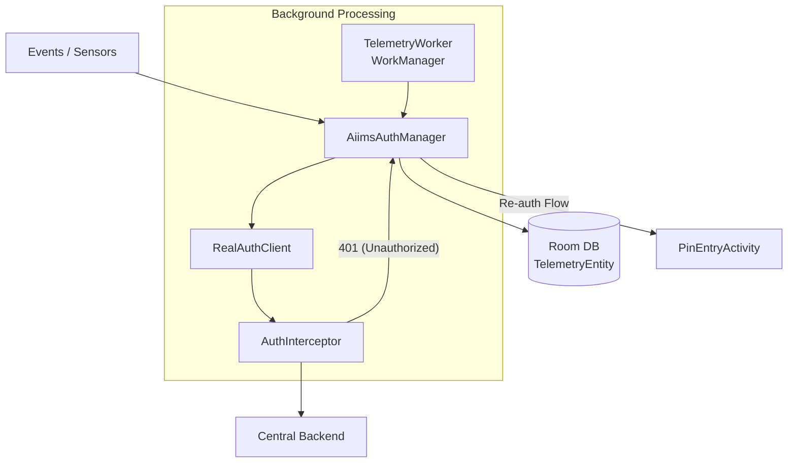

# Collect Telemetry Architecture - AIIMS Customization

> Last Updated: 2025-12-30

## Overview
The AIIMS Collect app uses a custom telemetry system for background tracking of device location, activity, and key application events (e.g., login, form opened). This system is designed to be **offline-first**, ensuring that no telemetry data is lost during periods of poor connectivity.

---

## 1. System Components

### Key Components:
- **`AiimsAuthManager`**: The central coordinator for telemetry. It handles immediate submissions and coordination with the local database.
- **`TelemetryEntity` (Room)**: Stores serialized telemetry requests when offline or when authentication is required.
- **`TelemetryWorker`**: A periodic WorkManager task that flushes queued telemetry when the device is online and the session is active.
- **`AuthInterceptor`**: An OkHttp interceptor that catches 401 status codes and triggers the AIIMS re-authentication flow.

---

## 2. Data Flow & Persistence

### Immediate Submission
When a high-priority event occurs (e.g., app lock/unlock), the app attempts an immediate submission via `AiimsAuthManager.submitTelemetry()`.

### Offline Queuing
If immediate submission fails due to network issues or a 401 error, the telemetry is stored in the local Room database:
- **`projectId`**: Associated Central project.
- **`serializedRequest`**: JSON representation of the `TelemetryRequest`.
- **`createdAt`**: Local timestamp for ordering and expiration logic.

### Background Sync
The `TelemetryWorker` runs periodically to process the queue. It retrieves entries from Room and attempts to send them in batches. Successfully sent entries are deleted from the local DB.

---

## 3. 401 Handling & Retry Logic

The telemetry system integrates with the global re-authentication flow:

1. **401 Detection**: The `AuthInterceptor` catches a 401 from the server.
2. **Interpretation**: Per the [Server API Spec](../ODK_Central_docs/vg-server/routes/telemetry.md), a 401 indicates **no record was created on the server**.
3. **Blocking Re-auth**: The interceptor calls `authManager.awaitReauthentication()`, which pauses the request and triggers a PIN prompt if the app is in the foreground.
4. **Automatic Retry**: Once the user successfully re-authenticates (gets a new token), the interceptor updates the original request and retries it.
5. **Queue Integrity**: If re-authentication is cancelled or the app is in the background, the telemetry remains in the local DB for the next `TelemetryWorker` run.

---

## 4. Response Status: "invalidated"

The server may return a `200 OK` with a body containing `status: "invalidated"`. 
- **Meaning**: The telemetry **was successfully recorded** on the server, but the session token is near core expiry (within the 2-day grace window).
- **Client Action**: The app treats this as a **Success** and removes the entry from the local queue to prevent duplicate submissions. The "invalidated" hint may be used by the manager to proactively refresh the session when next convenient.

---

## 5. Security Property: Deduplication
Telemetry events include a client-generated stable `id`. The server performs idempotent upserts based on `(appUserId, deviceId, event.id)`, allowing the client to safely retry without creating duplicate records.

---
 
 ## Related Documentation
 - [AIIMS vs. Standard Boundary](aiims_vs_standard_boundary.md)
 - [Authentication Architecture](authentication.md)
 - [Server Telemetry API](../ODK_Central_docs/vg-server/routes/telemetry.md)
- [Data Isolation](data-isolation.md)
