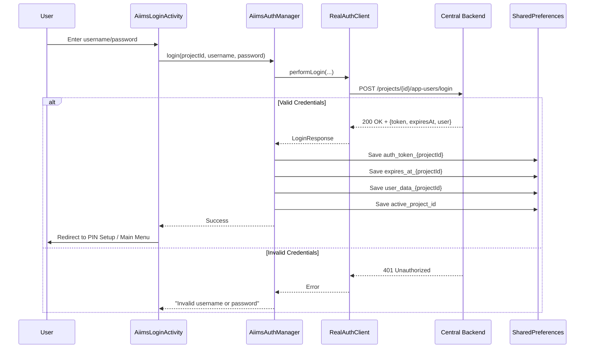
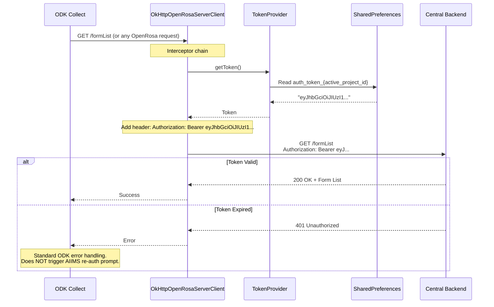
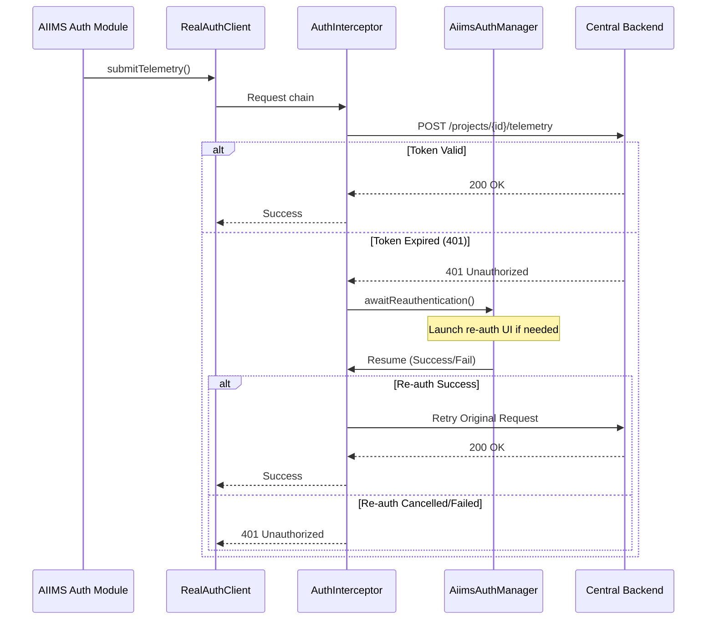
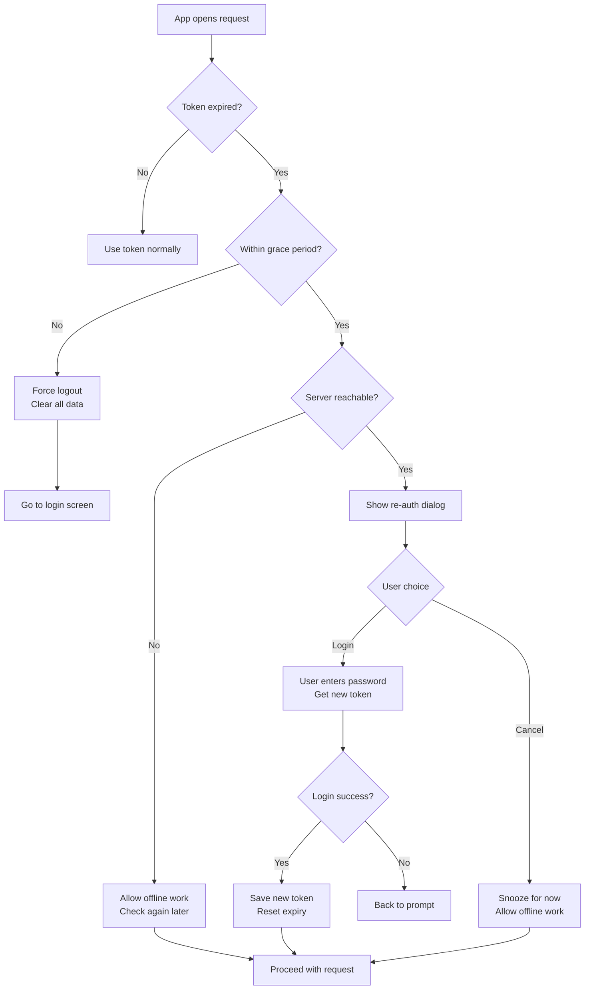

# Authentication System - AIIMS ODK Collect

> Last Updated: 2025-12-30
> Reviewed At: 2025-12-30

This document provides detailed documentation of the AIIMS authentication system, including the state machine, token lifecycle, and re-authentication flows.

---

## Overview

The AIIMS authentication system replaces ODK's standard Basic Auth with a custom Bearer Token system:

- **Short-lived tokens**: Default 3-day validity (configurable via server settings)
- **Bearer authentication**: JWT tokens injected via OkHttp interceptors
- **Offline grace period**: 6 hours of continued work after token expiry
- **Soft expiry**: User-friendly re-auth prompts when online
- **Hard expiry**: Forced logout after grace period deadline

---

## Authentication State Machine

### Complete State Diagram

```mermaid
stateDiagram-v2
    [*] --> LOGGED_OUT: App Start

    LOGGED_OUT --> LOGGED_IN: User logs in successfully

    state LOGGED_IN as "LOGGED_IN" {
        [*] --> ACTIVE
        ACTIVE --> GRACE_PERIOD: Token expires (time > expiresAt)

        state GRACE_PERIOD as "GRACE_PERIOD (≤6h)" {
            [*] --> CHECKING
            CHECKING --> OFFLINE_GRACE: Server unreachable
            CHECKING --> SOFT_EXPIRY: Server reachable

            OFFLINE_GRACE --> CHECKING: Periodic refresh check
            SOFT_EXPIRY --> RE_AUTHENTICATED: User re-enters password
            SOFT_EXPIRY --> OFFLINE_GRACE: User cancels ("Work Offline")
        }

        GRACE_PERIOD --> LOGGED_OUT: >6 hours past expiry (Hard Deadline)
    }

    LOGGED_IN --> LOGGED_OUT: User taps Logout
    LOGGED_IN --> LOGGED_OUT: 3 failed PIN attempts

    LOGGED_OUT --> [*]: App closed
```

---

## Token Lifecycle

### 1. Initial Login



### 2. Token Usage (OpenRosa Requests)



### 3. AIIMS API Usage (Telemetry, etc.)

For AIIMS-specific APIs, a global interceptor handles 401s and triggers re-authentication automatically.



### 4. Token Expiry Handling



---

## Data Structures

### SharedPreferences: `aiims_auth_prefs`

| Key | Type | Description | Example |
|-----|------|-------------|---------|
| `active_project_id` | String/Int | Currently selected Central project ID | `"1"` |
| `auth_token_{projectId}` | String | JWT bearer token | `"eyJhbGciOiJIUzI1NiIsInR5cCI6IkpXVCJ9..."` |
| `user_data_{projectId}` | JSON String | User profile (id, username, displayName) | `{"id": 12, "username": "user1", ...}` |
| `expires_at_{projectId}` | ISO 8601 String | Token expiry timestamp | `"2025-12-31T23:59:59.000Z"` |
| `api_url_{projectId}` | String | Central server base URL | `"https://central.example.com"` |

### LoginResponse (API)

```kotlin
data class LoginResponse(
    val token: String,        // JWT bearer token
    val expiresAt: String,    // ISO 8601 expiry timestamp
    val projectId: Long,      // Central project ID
    val user: AppUser         // User details
)

data class AppUser(
    val id: Long,
    val username: String,
    val displayName: String,
    val active: Boolean = true
)
```

---

## Time Constants

| Constant | Value | Purpose |
|----------|-------|---------|
| `DEFAULT_TOKEN_TTL_DAYS` | 3 | Server-side default token lifetime |
| `GRACE_PERIOD_MS` | `6 * 60 * 60 * 1000` (6h) | Offline grace after expiry |
| `SOFT_EXPIRY_CHECK_INTERVAL` | Variable | How often to check server reachability |
| `REAUTH_PROMPT_DELAY_MS` | 0 (immediate) | When to show re-auth after soft expiry |

---

## Re-Authentication Flow

### Triggering Re-Auth

Re-auth is triggered in these scenarios:

1. **Soft expiry detected** - Token expired but within grace period, server reachable (proactive check)
2. **Manual refresh** - User taps "Refresh Token" in settings
3. **AIIMS API 401** - `RealAuthClient` detects 401 and triggers blocking re-auth

### Re-Auth Mode

When `AiimsLoginActivity` is launched in re-auth mode:

```mermaid
flowchart LR
    Launch[Launch AiimsLoginActivity<br/>EXTRA_REAUTH_MODE = true] --> PreFill[Pre-fill username<br/>Disable username field]
    PreFill --> ShowPrompt[Show "Session Expired"<br/>Enter password to continue]
    ShowPrompt --> UserAction{User action}

    UserAction -->|Enter password| Validate[Validate password]
    UserAction -->|Press Back| Cancel[Allow offline<br/>Snooze soft expiry]

    Validate --> Valid{Valid?}
    Valid -->|Yes| Success[Fetch new token<br/>Update expiry<br/>Return to app]
    Valid -->|No| Error[Show error<br/>Allow retry]

    Success --> Done[Done]
    Cancel --> Done
    Error --> ShowPrompt
```

### Code: Re-Auth Intent

```kotlin
// Launching re-auth from AiimsAppLock
val intent = Intent(context, AiimsLoginActivity::class.java).apply {
    putExtra(AiimsLoginActivity.EXTRA_REAUTH_MODE, true)
    putExtra(AiimsLoginActivity.EXTRA_PROJECT_ID, currentProjectId)
    flags = Intent.FLAG_ACTIVITY_NEW_TASK or Intent.FLAG_ACTIVITY_CLEAR_TASK
}
context.startActivity(intent)
```

---

## Server Configuration

### Settings Endpoints

| Endpoint | Method | Auth | Purpose |
|----------|--------|------|---------|
| `/system/settings` | GET | Admin | Get TTL and cap values |
| `/system/settings` | PUT | Admin | Update TTL and cap values |

### Settings Response

```json
{
  "vg_app_user_session_ttl_days": "3",
  "vg_app_user_session_cap": "3"
}
```

- `vg_app_user_session_ttl_days`: Token lifetime in days
- `vg_app_user_session_cap`: Max concurrent sessions per user

---

## Security Properties

| Property | Implementation |
|----------|----------------|
| Token storage | Private SharedPreferences (app-only access) |
| Token transmission | HTTPS only |
| Token format | JWT (HS256) |
| Token lifetime | Short-lived (default 3 days) |
| Revocation | Server-side `/revoke` endpoint |
| Offline grace | 6 hours hard limit |
| Failed attempts | 3 PIN attempts = local logout |

---

## Error Handling

| Scenario | Detection | Response |
|----------|-----------|----------|
| Invalid credentials | Server returns 401 on login | Show error, allow retry |
| AIIMS API 401 | `RealAuthClient` detects 401 | Trigger blocking re-auth & retry |
| ODK API 401 | `OkHttpConnection` detects 401 | Return 401 error to ODK core |
| Token expired (online) | Time based detection | Trigger soft expiry flow (proactive) |
| Token expired (offline) | Local time > expiresAt | Allow work within grace period |
| Grace period exceeded | Local time > expiresAt + 6h | Force logout |
| Network unavailable | Catch exception during reachability check | Allow offline work if in grace |
| Malformed token | JWT parse exception | Treat as expired, trigger re-auth |

---

## Related Files

| File | Purpose |
|------|---------|
| `AiimsAuthManager.kt` | Core auth state management |
| `AiimsLoginActivity.kt` | Login and re-auth UI |
| `RealAuthClient.kt` | Retrofit API calls |
| `User.kt` | Data models for API responses |
| `OkHttpOpenRosaServerClientProvider.java` | Token injection interceptor |
| `AppDependencyModule.java` | TokenProvider implementation |

---

## Related Documentation

- [Architecture Overview](overview.md) - System architecture
- [AIIMS vs. Standard Boundary](aiims_vs_standard_boundary.md) - Clean separation rules
- [Collect Telemetry](Collect_telemetry.md) - Telemetry system design
- [Activities Reference](activities.md) - Activity details
- [Data Isolation](data-isolation.md) - Storage and persistence
- [API Reference](../03-API/reference.md) - Complete API docs
