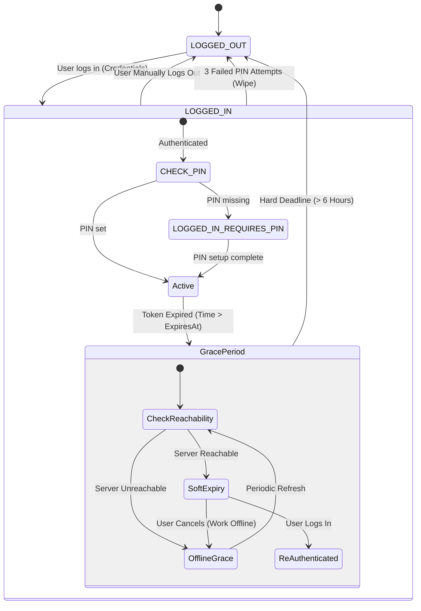
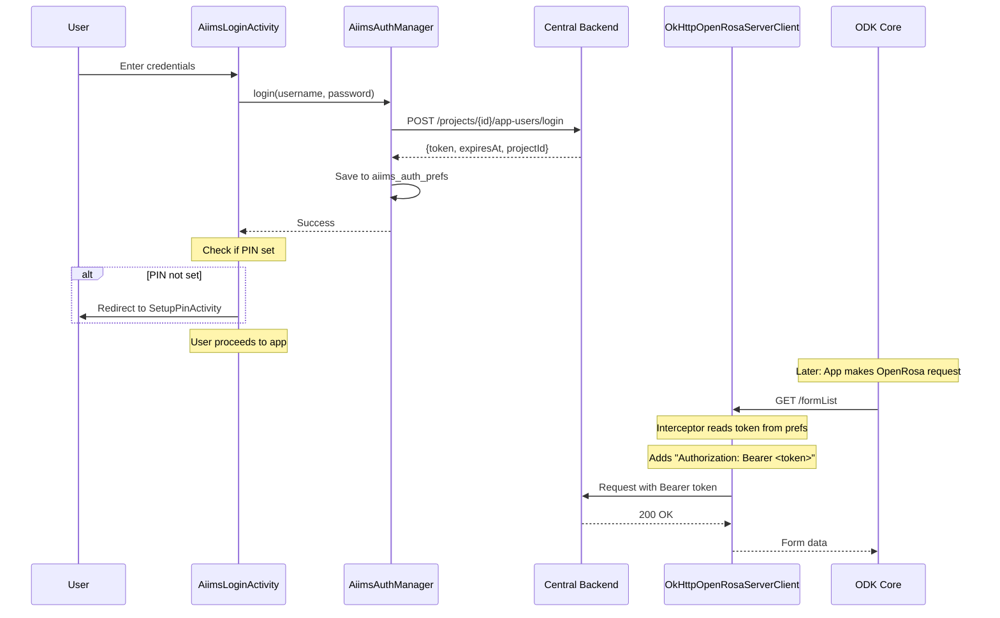
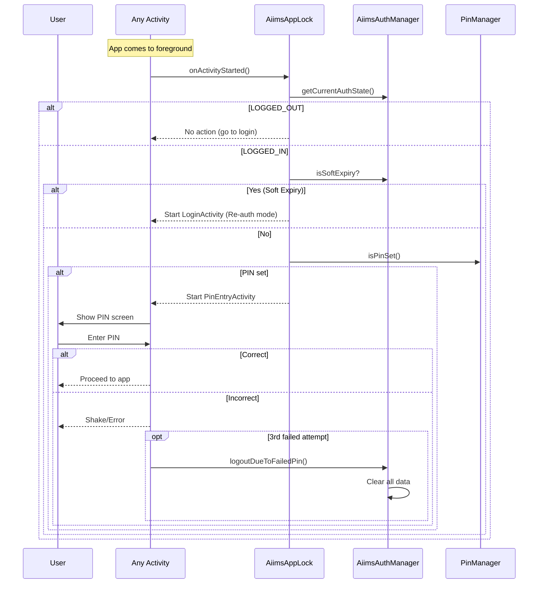
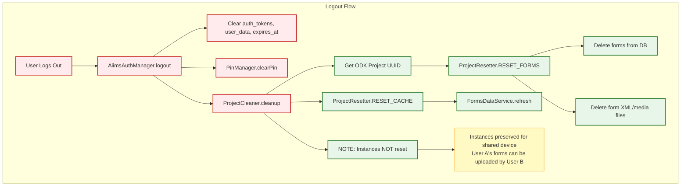

# AIIMS ODK Collect - Architecture Overview

> Last Updated: 2025-12-31
> Reviewed At: 2025-12-31

This document provides a high-level architecture overview of the AIIMS customizations to ODK Collect.

---

## Executive Summary

The AIIMS fork implements four major modifications to standard ODK Collect:

1. **Custom Authentication**: Replaces Basic Auth with Bearer Token system (short-lived JWT tokens)
2. **Local Networking**: Enables Android Emulator to resolve `central.local` to `10.0.2.2` with SSL bypass (debug only)
3. **PIN Security**: Enforces local PIN setup workflow immediately after login
4. **Project Persistence**: Fixes manual project configuration to persist using ODK's internal preference schemas

---

## System Architecture

```mermaid
graph TB
    subgraph "UI Layer"
        Login[AiimsLoginActivity]
        PinEntry[PinEntryActivity]
        SetupPin[SetupPinActivity]
        Settings[AuthSettingsActivity]
        MainMenu[MainMenuActivity]
    end

    subgraph "AIIMS Auth Module"
        AuthMgr[AiimsAuthManager]
        PinMgr[PinManager]
        AppLock[AiimsAppLock]
        ProjectCleaner[ProjectCleaner]
        Telemetry[TelemetryWorker]
    end

    subgraph "Network Layer"
        TokenProvider[TokenProvider]
        OkHttp[OkHttpOpenRosaServerClient]
        RealClient[RealAuthClient]
    end

    subgraph "ODK Core"
        Projects[ProjectsRepository]
        Forms[FormsDataService]
        Instances[InstancesRepository]
    end

    subgraph "Storage"
        AuthMetadata["aiims_auth_prefs<br/>(User, API URL, Names)"]
        AuthSecure["aiims_auth_secure<br/>(Tokens, Expiry, PIN)"]
        ODKPrefs["general_prefs{UUID}<br/>(Server URL, Settings)"]
        MetaPrefs["meta_prefs<br/>(Current Project ID)"]
        DB[(SQLite DB<br/>Forms/Instances)]
    end

    subgraph "Backend"
        Central[ODK Central<br/>+ Custom API]
    end

    Login --> AuthMgr
    AuthMgr --> RealClient
    RealClient --> Central

    AuthMgr --> TokenProvider
    TokenProvider --> OkHttp
    OkHttp --> Central

    AuthMgr --> AuthMetadata
    AuthMgr --> AuthSecure
    AuthMgr --> ODKPrefs
    AuthMgr --> MetaPrefs
    AuthMgr --> ProjectCleaner

    PinEntry --> PinMgr
    PinMgr --> AuthSecure
    AppLock --> AuthMgr
    AppLock --> PinMgr

    AuthMgr --> Projects
    ProjectCleaner --> Forms
    ProjectCleaner --> DB

    MainMenu --> Forms
    MainMenu --> Instances

    AuthMgr --> Telemetry
    Telemetry --> Central

    classDef ui fill:#e3f2fd,stroke:#1976d2,stroke-width:2px;
    classDef auth fill:#fff3e0,stroke:#f57c00,stroke-width:2px;
    classDef net fill:#f3e5f5,stroke:#7b1fa2,stroke-width:2px;
    classDef odk fill:#e8f5e9,stroke:#388e3c,stroke-width:2px;
    classDef storage fill:#fce4ec,stroke:#c2185b,stroke-width:2px;
    classDef backend fill:#cfd8dc,stroke:#455a64,stroke-width:2px;

    class Login,PinEntry,SetupPin,Settings,MainMenu ui;
    class AuthMgr,PinMgr,AppLock,ProjectCleaner,Telemetry auth;
    class TokenProvider,OkHttp,RealClient net;
    class Projects,Forms,Instances odk;
    class AuthMetadata,AuthSecure,ODKPrefs,MetaPrefs,DB storage;
    class Central backend;
```

---

## Authentication State Machine

---

## Data Flow: Login & Token Injection

---

## Data Flow: PIN Security & App Lock

---

## Data Isolation & Cleanup

---

## Component Responsibilities

### Authentication Layer

| Component | Responsibility |
|-----------|---------------|
| `AiimsAuthManager` | Central hub for auth state, login/logout, token retrieval |
| `AiimsLoginActivity` | Login UI, project detection, manual config, re-auth flow |
| `RealAuthClient` | Retrofit client for login API calls |
| `AuthApiService` | API endpoint definitions |

### Security Layer

| Component | Responsibility |
|-----------|---------------|
| `AiimsAppLock` | Activity lifecycle monitoring, PIN trigger on resume |
| `PinManager` | PIN hash storage (PBKDF2), validation, attempt counting |
| `PinEntryActivity` | PIN input UI with 3-attempt wipe |
| `SetupPinActivity` | Initial PIN setup after first login |
| `ChangePinActivity` | PIN change workflow |

### Data Layer

| Component | Responsibility |
|-----------|---------------|
| `ProjectCleaner` | Form cleanup on logout (preserves instances) |
| `TelemetryWorker` | Background telemetry (location, device info) |
| `aiims_auth_prefs` | Metadata preferences: User names, API URLs, Project Names |
| `aiims_auth_secure` | Secure storage: Token, Expiry, PIN Hash, Clock Validation |
| `general_prefs{UUID}` | ODK project settings (server URL, protocol) |

### Network Layer

| Component | Responsibility |
|-----------|---------------|
| `TokenProvider` | Interface for token retrieval (implemented in AppDependencyModule) |
| `OkHttpOpenRosaServerClientProvider` | Adds Bearer token interceptor, DNS mapping, SSL bypass |
| `OkHttpConnection` | Bridge for injecting custom client into ODK core |

---

## Key Design Decisions

### 1. Bearer Token vs Basic Auth

**Decision**: Replace ODK's Basic Auth with Bearer Token

**Rationale**:
- Short-lived tokens (3 days) improve security
- Server-side revocation capability
- Supports offline grace period

**Implementation**: OkHttp interceptor injects token into all OpenRosa requests

### 2. PIN Security on Top of Auth

**Decision**: Mandatory local PIN in addition to server credentials

**Rationale**:
- Protects against unauthorized device access
- 3-attempt wipe prevents brute force
- Works even when offline

**Implementation**: PBKDF2 hashing stored in `aiims_auth_prefs`

### 3. Forms Wiped, Instances Preserved

**Decision**: Delete blank forms on logout, keep filled instances

**Rationale**:
- Prevents new users from seeing old project forms
- Allows shared device workflows (User A fills, User B uploads)
- Instances are tied to form definitions

**Implementation**: `ProjectResetter` with `RESET_FORMS` only

### 4. Central Project ID vs ODK UUID

**Decision**: Maintain mapping between Central ID and ODK UUID

**Rationale**:
- ODK uses UUIDs internally
- Central API uses numeric IDs
- Critical for correct cleanup targeting

**Implementation**: `central_to_odk_$centralPid` in preferences

### 5. Grace Period for Offline Work

**Decision**: 6-hour grace after token expiry

**Rationale**:
- Field workers may have spotty connectivity
- Hard expiry would strand users offline
- Server unreachable check prevents unnecessary lockouts

**Implementation**: `GRACE_PERIOD_MS = 6 * 60 * 60 * 1000`

---

## Security Considerations

| Threat | Mitigation |
|--------|------------|
| Device theft | Mandatory PIN (4-digit, 3 attempts = wipe) |
| Token interception | Short-lived (3 days), HTTPS only |
| Offline brute force | PIN attempt counter, local wipe |
| QR bypass | QR only configures, still requires login |
| Session hijacking | Server-side revocation endpoint |
| Data leakage | Forms wiped on logout, instances tied to projects |

---

## Related Documentation

- [Authentication Flows](authentication.md) - Detailed auth state machine
- [AIIMS vs. Standard Boundary](aiims_vs_standard_boundary.md) - Clean separation rules
- [Network & Reachability](network_and_reachability.md) - Network monitoring & stability
- [Collect Telemetry](Collect_telemetry.md) - Telemetry system design
- [Logging & Events](logging_and_events.md) - Logging strategy and event details
- [Activities Reference](activities.md) - All AIIMS activities
- [Data Isolation](data-isolation.md) - Persistence & storage details
- [PIN Security](../05-FEATURES/pin-security.md) - PIN implementation details
- [QR Workflow](../05-FEATURES/qr-workflow.md) - QR code configuration

---

## File Locations

| Module | Path |
|--------|------|
| Auth Module | `aiims_auth_module/src/main/java/org/aiims/odk/auth/` |
| Activities | `aiims_auth_module/.../activities/` |
| Managers | `aiims_auth_module/.../managers/` |
| API | `aiims_auth_module/.../api/` |
| Network Injection | `collect_app/.../injections/AppDependencyModule.java` |
| OkHttp Client | `open-rosa/.../OkHttpOpenRosaServerClientProvider.java` |
| ProGuard Rules | `collect_app/proguard-rules.pro` |
