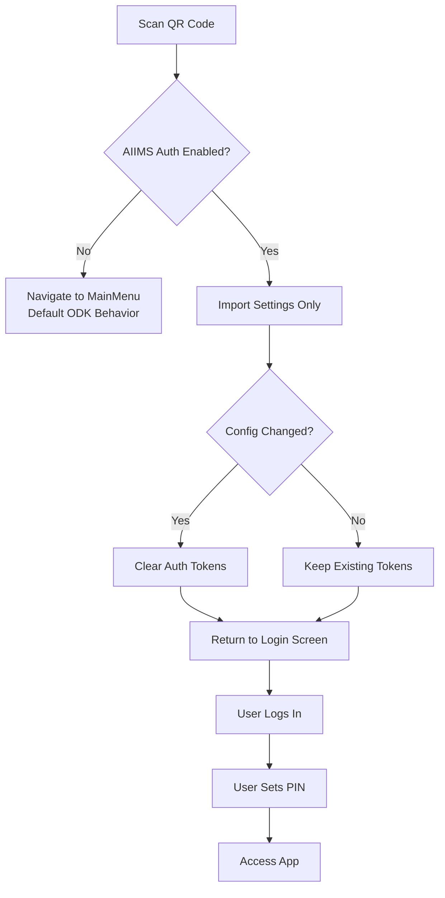

# AIIMS QR Code Workflow

## Overview

This document describes how QR code scanning works differently in AIIMS vs default ODK Collect. This is a **core feature change** from default ODK behavior.

## QR Code Payload Format

```json
{
  "general": {
    "server_url": "https://central.local/v1/projects/1",
    "username": "app_user",
    "form_update_mode": "match_exactly",
    "automatic_update": true,
    "delete_send": false,
    "default_completed": false,
    "analytics": true,
    "metadata_username": "App User Display Name"
  },
  "admin": {
    "change_server": false,
    "admin_pw": "SOME_STRING"
  },
  "project": {
    "name": "Project Name",
    "project_id": "1"
  }
}
```

The payload is:
1. Serialized to JSON
2. Compressed via zlib DEFLATE
3. Base64 encoded
4. Encoded into QR code

---

## Behavior Comparison

### Default ODK QR Behavior (DISABLED for AIIMS)

| Step | Action |
|------|--------|
| 1 | Scan QR code |
| 2 | Import all settings (including auth tokens if present) |
| 3 | **Navigate directly to MainMenuActivity** |
| 4 | User is immediately authenticated and can use the app |

**Additional Features:**
- Multiple projects can be added via Settings → Project Management → Import Settings
- Projects can be deleted

### AIIMS QR Behavior (NEW)

| Step | Action |
|------|--------|
| 1 | Scan QR code from login screen |
| 2 | Import settings (server_url, project settings ONLY) |
| 3 | **Return to Login Screen** with project configured |
| 4 | User MUST authenticate via username/password |
| 5 | After login, user sets up PIN |

**Key Restrictions:**
- QR codes CANNOT bypass AIIMS authentication
- 'Import Settings' option HIDDEN from Project Management
- 'Delete Project' option HIDDEN from Project Management
- Single project enforcement (no multi-project support)

---

## Configuration Change Detection

When a QR code is rescanned that changes critical settings:

| Changed Setting | Action |
|-----------------|--------|
| `server_url` | Clear auth tokens → Logout → "Please login again" |
| `username` | Clear auth tokens → Logout → "Please login again" |
| Other settings | Apply without logout |

---

## Implementation Details

### Files Modified

#### 1. `QRCodeActivityResultDelegate.kt`
```kotlin
// Check if AIIMS auth is enabled - if so, just finish to return to login
if (isAiimsAuthEnabled()) {
    activity.finish()
} else {
    ActivityUtils.startActivityAndCloseAllOthers(activity, MainMenuActivity::class.java)
}
```

#### 2. `QRCodeScannerFragment.kt`
```kotlin
// Capture old settings for logout-on-change detection
val oldServerUrl = settingsProvider.getUnprotectedSettings().getString(ProjectKeys.KEY_SERVER_URL)
val oldUsername = settingsProvider.getUnprotectedSettings().getString(ProjectKeys.KEY_USERNAME)

// After import, check for changes
if (oldServerUrl != newServerUrl || oldUsername != newUsername) {
    clearAiimsAuthTokens()
    showLongToast("Configuration changed. Please login again.")
}
requireActivity().finish()
```

#### 3. `ProjectManagementPreferencesFragment.kt`
```kotlin
// Hide QR import and delete project options for AIIMS auth
if (isAiimsAuthEnabled()) {
    findPreference<Preference>(IMPORT_SETTINGS_KEY)?.isVisible = false
    findPreference<Preference>(DELETE_PROJECT_KEY)?.isVisible = false
}
```

### Feature Flag Check

All files check the `aiims_auth_enabled` manifest metadata:

```kotlin
private fun isAiimsAuthEnabled(): Boolean {
    return context.packageManager.getApplicationInfo(context.packageName, 0)
        .metaData?.getBoolean("aiims_auth_enabled", false) ?: false
}
```

---

## Security Implications

| Aspect | Protection |
|--------|------------|
| Authentication Bypass | QR cannot skip AIIMS login |
| Session Hijacking | Tokens invalidated on server/project change |
| Multi-project Attack | Single project enforcement |
| Unauthorized Access | All auth flows go through AIIMS module |

---

## Flow Diagram



---

## Testing Checklist

- [ ] Scan QR from login → returns to login with project info displayed
- [ ] Login with username/password → redirects to PIN setup
- [ ] Rescan different QR (different server) → logout + "Please login again"
- [ ] Rescan different QR (different username) → logout + "Please login again"
- [ ] Project settings → QR import option NOT visible
- [ ] Project settings → Delete project option NOT visible
- [ ] ODK flavor → default behavior preserved (navigate to MainMenu)

### How Project UUID gets Generated
The Project UUID (used in file naming like `general_prefs{uuid}`) is generated automatically by ODK Collect's `SharedPreferencesProjectsRepository`.

- **Mechanism:** It uses `UUID.randomUUID().toString()` to produce a random Version 4 UUID.
- **Timing:** Generation happens at the moment a new project is created or imported via QR code.
- **Uniqueness:** Each import/creation results in a globally unique identifier to prevent collisions between projects.

---

## ODK SharedPreferences Naming Convention

ODK Collect uses a non-standard naming convention for SharedPreferences files:

| File Pattern | Purpose | Example Keys |
|--------------|---------|--------------|
| `general_prefs{projectUUID}` | General/unprotected settings | `server_url`, `username`, `form_update_mode` |
| `admin_prefs{projectUUID}` | Admin/protected settings | `change_server`, `admin_pw` |
| `meta` | Global metadata | `current_project_id`, `projects` |

### Example File Names
```
/shared_prefs/general_prefs50b18a62-39c0-4053-b3a4-4989547c2ce5.xml
/shared_prefs/admin_prefs50b18a62-39c0-4053-b3a4-4989547c2ce5.xml
/shared_prefs/meta.xml
```

### Why This Matters
When reading project settings in AIIMS code, use:
```kotlin
// CORRECT
val prefsName = "general_prefs$projectId"

// WRONG - this file doesn't exist!
val prefsName = "org.odk.collect.android_preferences_$projectId"
```

> **Note:** This naming is an existing ODK convention defined in `SettingsProvider`. Changing it would require migration logic for existing users.

---

## Related Beads Issues

- `collect-92k`: QR scan bypasses AIIMS login and causes provider crash
- `collect-0j4`: Test QR code scanning on AIIMS login screen