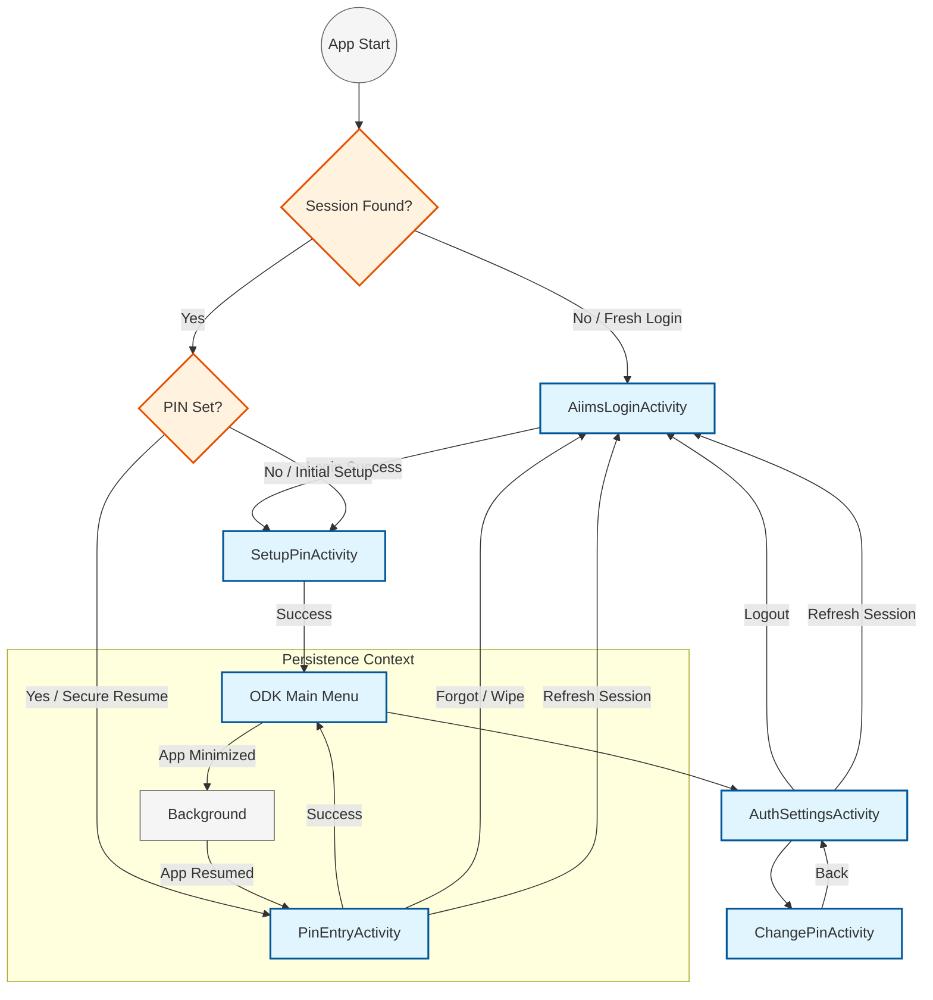

# AIIMS Custom Activities

This document provides a comprehensive list of activities introduced as part of the AIIMS customizations in ODK Collect. These activities are primarily located in the `aiims-auth-module`.

## Overview

The AIIMS customization adds a layer of security and authentication on top of standard ODK Collect. This is achieved through several key activities that handle login, PIN security, and session management.

---

## 1. Core Authentication & Login

### [AiimsLoginActivity](../../aiims-auth-module/src/main/java/org/aiims/odk/auth/activities/AiimsLoginActivity.kt)
**Purpose**: The primary entry point for AIIMS users. It replaces the standard ODK authentication flow with a custom Bearer Token system.

- **Layout Files**:
    - [activity_aiims_login.xml](../../aiims-auth-module/src/main/res/layout/activity_aiims_login.xml): Main login screen UI.
    - [dialog_manual_config.xml](../../aiims-auth-module/src/main/res/layout/dialog_manual_config.xml): Advanced server/project configuration dialog.
- **Key Responsibilities**:
    - **Project Detection**: Automatically detects the current ODK Project from metadata or QR code.
    - **Custom Authentication**: Authenticates against the AIIMS custom backend to obtain a short-lived JWT token.
    - **Manual Configuration**: Provides a dialog for manually setting the Server URL and Project ID.
    - **Re-authentication**: Handles "Soft Expiry" by prompting users to re-enter their password without logging out of the device.
    - **Permissions**: Ensures required Location and Notification permissions are granted.

---

## 2. PIN Security Flow

### [PinEntryActivity](../../aiims-auth-module/src/main/java/org/aiims/odk/auth/activities/PinEntryActivity.kt)
**Purpose**: Acts as a security barrier whenever the app is launched or resumed from the background.

- **Layout File**: [activity_pin_entry.xml](../../aiims-auth-module/src/main/res/layout/activity_pin_entry.xml)
- **Key Responsibilities**:
    - **Authentication Guard**: Verifies the user's 4-digit PIN before allowing access to the main app.
    - **Security Enforcement**: Prevents bypassing via the "Back" button (minimizes the app instead).
    - **Max Attempts**: Implements a "3 failed attempts" policy, after which the session and PIN are wiped for security.
    - **Token Management**:
        - Displays time remaining until the bearer token expires.
        - Provides a **"Refresh Token"** button to trigger manual re-authentication if the session is near expiry.

### [SetupPinActivity](../../aiims-auth-module/src/main/java/org/aiims/odk/auth/activities/SetupPinActivity.kt)
**Purpose**: A one-time setup screen forced immediately after the first successful login.

- **Layout File**: [activity_setup_pin.xml](../../aiims-auth-module/src/main/res/layout/activity_setup_pin.xml)
- **Key Responsibilities**:
    - **PIN Creation**: Allows users to set their initial 4-digit security PIN.
    - **Verification**: Requires PIN confirmation to ensure no typos.

### [ChangePinActivity](../../aiims-auth-module/src/main/java/org/aiims/odk/auth/activities/ChangePinActivity.kt)
**Purpose**: Provides a way for users to update their existing PIN.

- **Layout File**: [activity_change_pin.xml](../../aiims-auth-module/src/main/res/layout/activity_change_pin.xml)
- **Key Responsibilities**:
    - **Current PIN Verification**: Requires the user to enter their existing PIN before setting a new one.
    - **Secure Update**: Updates the PIN locally and returns the user to the settings screen.

---

## 3. Session & Device Management

### [AuthSettingsActivity](../../aiims-auth-module/src/main/java/org/aiims/odk/auth/activities/AuthSettingsActivity.kt)
**Purpose**: A dedicated settings screen for managing the AIIMS authentication state.

- **Layout File**: [activity_auth_settings.xml](../../aiims-auth-module/src/main/res/layout/activity_auth_settings.xml)
- **Key Responsibilities**:
    - **Status Overview**: Displays the current username, active project name, and token validity/expiry details.
    - **Project Details**: Allows fetching and viewing detailed project information from ODK Central.
    - **Session Control**: Provides "Refresh Token" (Re-auth) and "Logout" actions.
    - **Device Identity**: Displays the ODK Install ID for debugging and tracking.
    - **Quick Actions**: Link to `ChangePinActivity`.

---

## 4. AIIMS Specific Settings & Entry Points

Beside dedicated activities, the AIIMS customization injects several entry points into the standard app UI to manage settings.

### Login Screen: Manual Configuration
- **Entry Point**: A gear icon (Settings) on the top right of the [AiimsLoginActivity](../../aiims-auth-module/src/main/java/org/aiims/odk/auth/activities/AiimsLoginActivity.kt).
- **Function**: Opens the [dialog_manual_config.xml](../../aiims-auth-module/src/main/res/layout/dialog_manual_config.xml) to manually override the server configuration.
- **Fields**:
  - **Base URL**: The ODK Central server address (e.g., `https://central.local`).
  - **Project ID**: The numeric ID of the project on Central.
  - **Dev Server IP**: (Debug Builds Only) Allows redirection for local development testing.

### Main Menu: Authentication Settings
- **Entry Point**: A preference icon (Auth Settings) in the toolbar of the standard ODK [MainMenuActivity](../../collect_app/src/main/java/org/odk/collect/android/mainmenu/MainMenuActivity.kt).
- **Implementation**: The item is injected via `MainMenuFragment.onOptionsItemSelected`.
- **Function**: Launches the [AuthSettingsActivity](../../aiims-auth-module/src/main/java/org/aiims/odk/auth/activities/AuthSettingsActivity.kt) to manage the session, change PIN, or view token details.

---

## 5. Token Expiry & Manual Refresh Flow

AIIMS uses short-lived tokens. The application handles expiry through a multi-stage process:

1.  **Expiry Monitoring**: Both `PinEntryActivity` and `AuthSettingsActivity` observe the token's remaining life.
2.  **Manual Refresh**: Users can proactively refresh their session by clicking the **"Refresh Token"** button. This launches `AiimsLoginActivity` in a specialized **Re-authentication Mode**.
3.  **Re-authentication Mode**:
    - The username is pre-filled and locked.
    - The user only needs to enter their password.
    - Upon success, the session is updated with a fresh token without requiring a full logout or PIN reset.
4.  **Grace Period**: If a token expires while the device is offline, a **6-hour grace period** allows continued work until the server becomes reachable or the hard deadline is hit.

---

## 6. AIIMS Background Telemetry

The AIIMS customization includes a background telemetry system to provide an audit trail and monitor device presence.

### [TelemetryWorker](../../aiims-auth-module/src/main/java/org/aiims/odk/auth/work/TelemetryWorker.kt)
**Purpose**: A background process that ensures the server is notified of the device's status and location periodically.

- **Trigger Points**:
    - **Login**: `AiimsLoginActivity` sends initial telemetry upon successful authentication.
    - **PIN Entry**: `PinEntryActivity` sends telemetry every time the app is securely unlocked.
    - **Periodic Heartbeat**: `AiimsAuthManager` schedules a `PeriodicWorkRequest` that runs every **20 minutes**.
- **Data Captured**:
    - **Device Identity**: ODK Install ID.
    - **App Version**: Current ODK Collect version.
    - **Timestamp**: Local device time when the event occurred.
    - **Location**: GPS coordinates (Latitude, Longitude) if permissions are granted; otherwise, "unknown".
- **Backend Endpoint**: `POST /projects/{projectId}/app-users/telemetry`

---

## 7. Infrastructure

### [AiimsBaseActivity](../../aiims-auth-module/src/main/java/org/aiims/odk/auth/activities/AiimsBaseActivity.kt)
**Purpose**: The abstract base class for all AIIMS-specific activities.

- **Key Responsibilities**:
    - **Dependency Injection**: Centralizes Dagger injection logic using `AiimsAuthDependencyComponent`.
    - **Permission Management**: Provides a unified method (`checkAndRequestPermissions`) to handle Location and Notification requests.
    - **Location Utilities**: Contains helper methods to retrieve the last known location for telemetric purposes.

---

## 8. Activity Flow Diagram

---

## 9. Relevant Documentation
- [AIIMS Architecture](AIIMS_ARCHITECTURE.md)
- [AIIMS API Documentation](AIIMS_API.md)
- [AIIMS Maintenance Guide](AIIMS_MAINTENANCE.md)
- [AIIMS Preferences & Persistence](AIIMS_PREFERENCES.md)
