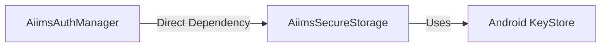
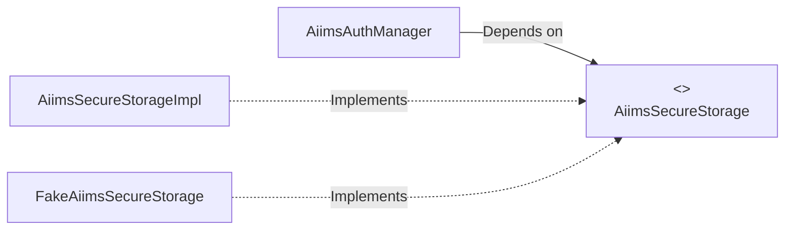

# Test Refactor: AIIMS Auth Module

**Status**: Completed (Commit `0be04a1a14`)
**Date**: 2025-12-30

## 1. Problem Statement
The `aiims-auth-module` unit tests were suffering from flakiness and runtime failures due to two primary architectural issues:

1.  **Hard Dependency on Android KeyStore**: The `AiimsSecureStorage` class relied on `EncryptedSharedPreferences`, which internally attempts to access the Android KeyStore. In Robolectric test environments, the KeyStore is often unavailable or behaves inconsistently, leading to `KeyStoreException` and `NullPointerException`.
2.  **Mocking Final Classes**: Kotlin classes are `final` by default. The tests attempted to mock `AiimsAuthManager` and `AiimsAuthStorage` using Mockito without the `mock-maker-inline` extension enabled. This caused "NeverWantedButInvoked" errors because the mocks were not actually proxying calls correctly, leading to test logic executing against uninitialized objects.

## 2. Solution: Dependency Inversion Architecture
To resolve this, we applied the **Dependency Inversion Principle (DIP)**. We decoupled the business logic (Managers) from the concrete data persistence layer (Storage).

### Architecture Changes

#### Before (Tightly Coupled)

*Result: Tests crash because they implicitly load the KeyStore.*

#### After (Decoupled with Interfaces)

*Result: Tests inject `FakeAiimsSecureStorage`, completely bypassing the KeyStore.*

## 3. Implementation Details

### A. Interface Extraction
We split the existing monolithic storage classes into Interfaces and Implementations.

*   **`AiimsAuthStorage` (Interface)**: Defines the contract for general auth data (User ID, Project ID, Token).
*   **`AiimsAuthStorageImpl`**: The original concrete implementation that uses standard `SharedPreferences`.
*   **`AiimsSecureStorage` (Interface)**: Defines the contract for sensitive data (Refresh Token, PIN, Clock validation).
*   **`AiimsSecureStorageImpl`**: The original concrete implementation that uses `EncryptedSharedPreferences`.

### B. The "Fake" Pattern (Test Doubles)
Instead of using fragile Mockito mocks, we implemented **Fakes** in the test source set. Fakes are working implementations that store state in memory.

*   **`FakeAiimsAuthStorage`**: Uses a `MutableMap<String, Any?>` to store preferences.
*   **`FakeAiimsSecureStorage`**: Simulates secure storage behavior in memory.

**Why Fakes?**
*   **Behavioral Verification**: Fakes maintain state. If you call `saveToken("abc")`, a subsequent call to `getToken()` actually returns `"abc"`. Mocks require manual stubbing for every single interaction (`when(mock.getToken()).thenReturn(...)`), which is error-prone.
*   **Speed**: Fakes run instantly in memory without invoking Android framework code.

### C. Dependency Injection Updates
We updated `DaggerSetup.kt` to bind the new interfaces to their real implementations for the production app.

```kotlin
@Provides
fun providesAiimsAuthStorage(context: Context): AiimsAuthStorage {
    return AiimsAuthStorageImpl.getInstance(context) // Inject Real Impl
}
```

## 4. Test Refactoring

### `AiimsAuthManagerTest`
*   **Old Approach**: Used `@Mock lateinit var storage: AiimsAuthStorage`. Failed because the class was final.
*   **New Approach**:
    ```kotlin
    private lateinit var authStorage: FakeAiimsAuthStorage
    
    @Before
    fun setUp() {
        authStorage = FakeAiimsAuthStorage() // Use Fake
        authManager = AiimsAuthManager(..., authStorage, ...)
    }
    ```

### `AiimsAppLockTest`
This test was refactored to verify the integration between the AppLock logic and the Auth Manager.

*   **Old Approach**: Mocked `AiimsAuthManager`. Failed with `NeverWantedButInvoked` because the mock didn't update its internal state (`LOGIN` vs `LOGOUT`).
*   **New Approach**: Used the **Real** `AiimsAuthManager` injected with **Fakes**.
    *   Added `@VisibleForTesting fun setIsSoftExpiry(value: Boolean)` to `AiimsAuthManager` to allow tests to forcefully simulate soft token expiry without complex time/network manipulation.

## 5. Summary of Files Changed

| Component | File | Change Description |
| :--- | :--- | :--- |
| **Interfaces** | `AiimsAuthStorage.kt`<br>`AiimsSecureStorage.kt` | Extracted public API contracts. |
| **Implementations** | `AiimsAuthStorageImpl.kt`<br>`AiimsSecureStorageImpl.kt` | Renamed original classes to implement interfaces. |
| **Fakes** | `FakeAiimsAuthStorage.kt`<br>`FakeAiimsSecureStorage.kt` | Created in-memory implementations for testing. |
| **DI** | `DaggerSetup.kt` | Updated Dagger modules to provide `*Impl` classes. |
| **Tests** | `AiimsAuthManagerTest.kt`<br>`AiimsAppLockTest.kt` | Rewritten to use Fakes instead of Mocks. |
