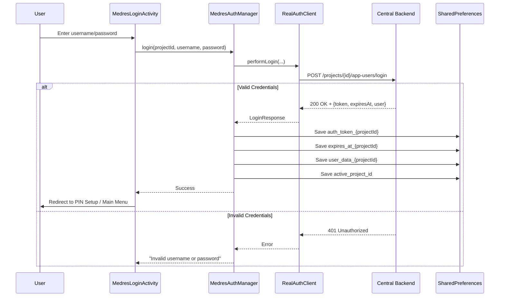
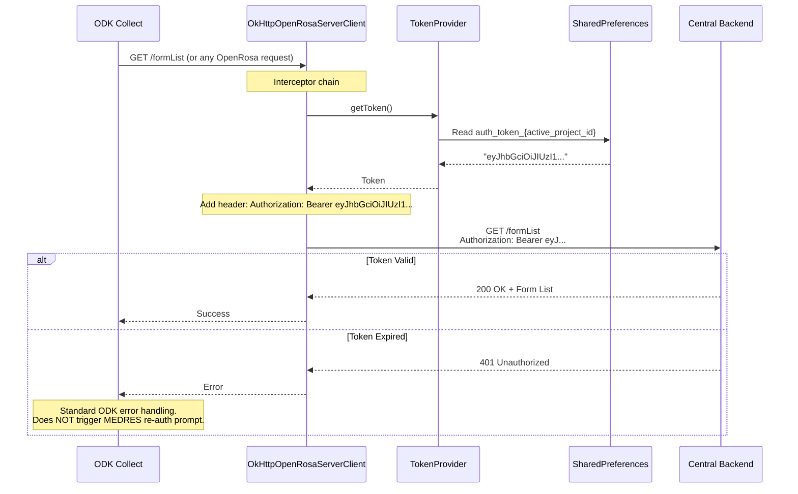
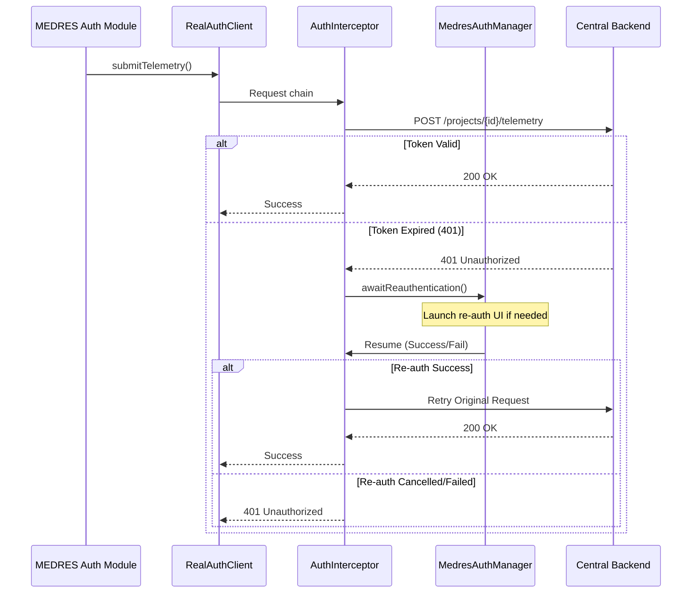
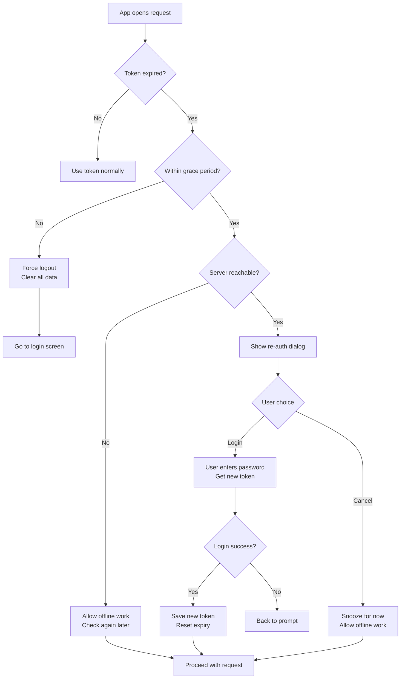
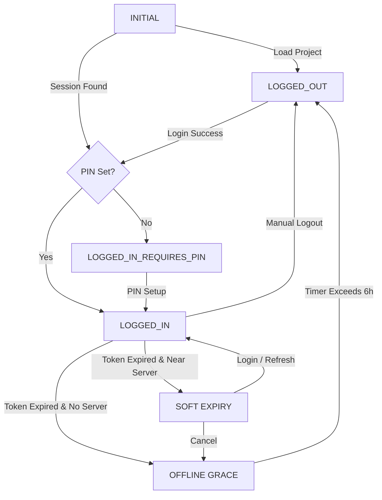

# Authentication System - MEDRES ODK Collect

> Last Updated: 2025-12-31
> Reviewed At: 2025-12-31

This document provides detailed documentation of the MEDRES authentication system, including the state machine, token lifecycle, and re-authentication flows.

---

## Overview

The MEDRES authentication system replaces ODK's standard Basic Auth with a custom Bearer Token system:

- **Short-lived tokens**: Default 3-day validity (configurable via server settings)
- **Bearer authentication**: JWT tokens injected via OkHttp interceptors
- **Offline grace period**: 6 hours of continued work after token expiry
- **Network Monitoring**: Smart re-checks for immediate re-auth (see [Network & Reachability](network_and_reachability.md))
- **Soft expiry**: User-friendly re-auth prompts when online
- **Hard expiry**: Forced logout after grace period deadline
- **Expiry reminders**: Multi-tier warnings at 8h, 3h, 1h, 30m, 15m, and 3m before expiry

---

## Authentication State Machine

### Complete State Diagram

```mermaid
stateDiagram-v2
    [*] --> LOGGED_OUT: App Start

    LOGGED_OUT --> LOGGED_IN: User logs in successfully

    state LOGGED_IN as "LOGGED_IN" {
        [*] --> ACTIVE
        ACTIVE --> GRACE_PERIOD: Token expires (time > expiresAt)

        state GRACE_PERIOD as "GRACE_PERIOD (≤6h)" {
            [*] --> CHECKING
            CHECKING --> OFFLINE_GRACE: Server unreachable
            CHECKING --> SOFT_EXPIRY: Server reachable

            OFFLINE_GRACE --> CHECKING: Periodic refresh check
            SOFT_EXPIRY --> RE_AUTHENTICATED: User re-enters password
            SOFT_EXPIRY --> OFFLINE_GRACE: User cancels ("Work Offline")
        }

        GRACE_PERIOD --> LOGGED_OUT: >6 hours past expiry (Hard Deadline)
    }

    LOGGED_IN --> LOGGED_OUT: User taps Logout
    LOGGED_IN --> LOGGED_OUT: 3 failed PIN attempts

    LOGGED_OUT --> [*]: App closed
```

---

## Token Lifecycle

### 1. Initial Login



### 2. Token Usage (OpenRosa Requests)



### 3. MEDRES API Usage (Telemetry, etc.)

For MEDRES-specific APIs, a global interceptor handles 401s and triggers re-authentication automatically.



### 4. Token Expiry Handling



---

## Data Structures

### SharedPreferences: `medres_auth_prefs` (Metadata)

| Key | Type | Description | Example |
|-----|------|-------------|---------|
| `active_project_id` | String | Currently selected Central project ID | `"1"` |
| `user_data_{pid}` | JSON String | Cached user profile (id, username, etc.) | `{"id": "12", "username": "user1", ...}` |
| `api_url_{pid}` | String | Base URL for the specific project | `"https://central.example.com"` |
| `project_name_{pid}` | String | Cached project display name | `"Main Research Site"` |

### Secure Storage: `medres_auth_secure` (Encrypted)

Sensitive data is stored via `EncryptedSharedPreferences` and is not visible to the standard preferences layer.

| Key | Type | Description |
|-----|------|-------------|
| `deviceToken` | String | JWT bearer token |
| `tokenExpiry` | Long | Expiry timestamp in milliseconds |
| `projectId` | String | Project ID associated with the token |
| `userId` | String | User ID associated with the token |

### API Data Models (Central Backend)

#### LoginResponse
```kotlin
data class LoginResponse(
    val token: String,
    val projectId: Int,
    val expiresAt: String,     // ISO 8601
    val id: Int,               // App User ID
    val serverTime: String?    // ISO 8601 server current time
)
```

#### User (Internal Model)
```kotlin
data class User(
    val id: String,
    val username: String,
    val projectId: String,
    val expiresAt: String?
)
```

---

## Time Constants

| Constant | Value | Purpose |
|----------|-------|---------|
| `DEFAULT_TOKEN_TTL_DAYS` | 3 | Server-side default token lifetime |
| `GRACE_PERIOD_MS` | 6h | Offline grace after expiry |
| `EXPIRY_REMINDER_TIERS_MS` | 8h, 3h, 1h, 30m, 15m, 3m | Multi-tier "Expiring Soon" warnings |
| `REAUTH_PROMPT_DELAY_MS` | 0 | Immediate re-auth prompt after soft expiry |

---

## Authentication & Application States

The system uses a combination of a core state machine (`AuthState`) and secondary reactive flags to determine the UI/UX behavior.

### 1. Core Auth States (`AuthState`)

| State | Description | UI Impact |
|-------|-------------|-----------|
| `INITIAL` | Project switched or manager just started | Loading state/Splash |
| `LOGGED_IN` | User is authenticated with a valid (or grace) token | Accessible Main Menu |
| `LOGGED_IN_REQUIRES_PIN` | Authenticated but PIN is missing or cleared | Redirect to PIN Setup |
| `LOGGED_OUT` | No active session or hard expiry exceeded | Redirect to Login |
| `ERROR` | Critical storage or logic failure | Show error, allow recovery |

### 2. Secondary UX States (Reactive Flags)

These flags further refine the user experience when the state is `LOGGED_IN`.

| Goal | Flag | Logic | UX Behavior |
|------|------|-------|-------------|
| **Soft Expiry** | `isSoftExpiry` | `currentTime > expiresAt` AND `serverReachable` | Show "Session Expired" prompt; Allow Work Offline. |
| **Offline Grace** | `isSoftExpiry` (false) | `currentTime > expiresAt` AND `serverUnreachable` | Silent operation; No prompt; Countdown to hard deadline begins. |
| **Hard Expiry** | Transition to `LOGGED_OUT` | `currentTime > (expiresAt + 6h)` | Automated logout; Session revoked; User forced to Login. |
| **Expiring Soon** | `isExpiringSoon` | `currentTime + 24h > expiresAt` | (Optional) Warning icon or message in settings. |
| **Refreshing** | `isLoading` | Active login or refresh call | Show progress spinner; Disable buttons. |
| **PIN Locked** | (Managed by `MedresAppLock`) | Backgrounded OR Timeout | Intercepts navigation; Forces PIN validation before Main Menu. |

### 3. State Transitions



---

## Re-Authentication Flow

### Triggering Re-Auth

Re-auth is triggered in these scenarios:

1. **Soft expiry detected** - Token expired but within grace period, server reachable (proactive check)
2. **Manual refresh** - User taps "Refresh Token" in settings
3. **MEDRES API 401** - `RealAuthClient` detects 401 and triggers blocking re-auth

### Re-Auth Mode

When `MedresLoginActivity` is launched in re-auth mode:

```mermaid
flowchart LR
    Launch[Launch MedresLoginActivity<br/>EXTRA_REAUTH_MODE = true] --> PreFill[Pre-fill username<br/>Disable username field]
    PreFill --> ShowPrompt[Show "Session Expired"<br/>Enter password to continue]
    ShowPrompt --> UserAction{User action}

    UserAction -->|Enter password| Validate[Validate password]
    UserAction -->|Press Back| Cancel[Allow offline<br/>Snooze soft expiry]

    Validate --> Valid{Valid?}
    Valid -->|Yes| Success[Fetch new token<br/>Update expiry<br/>Return to app]
    Valid -->|No| Error[Show error<br/>Allow retry]

    Success --> Done[Done]
    Cancel --> Done
    Error --> ShowPrompt
```

### Code: Re-Auth Intent

```kotlin
// Launching re-auth from MedresAppLock
val intent = Intent(context, MedresLoginActivity::class.java).apply {
    putExtra(MedresLoginActivity.EXTRA_REAUTH_MODE, true)
    putExtra(MedresLoginActivity.EXTRA_PROJECT_ID, currentProjectId)
    flags = Intent.FLAG_ACTIVITY_NEW_TASK or Intent.FLAG_ACTIVITY_CLEAR_TASK
}
context.startActivity(intent)
```

---

## Server Configuration

### Settings Endpoints

| Endpoint | Method | Auth | Purpose |
|----------|--------|------|---------|
| `/system/settings` | GET | Admin | Get TTL and cap values |
| `/system/settings` | PUT | Admin | Update TTL and cap values |

### Settings Response

```json
{
  "vg_app_user_session_ttl_days": "3",
  "vg_app_user_session_cap": "3"
}
```

- `vg_app_user_session_ttl_days`: Token lifetime in days
- `vg_app_user_session_cap`: Max concurrent sessions per user

---

## Security Properties

| Property | Implementation |
|----------|----------------|
| Token storage | Private SharedPreferences (app-only access) |
| Token transmission | HTTPS only |
| Token format | JWT (HS256) |
| Token lifetime | Short-lived (default 3 days) |
| Revocation | Server-side `/revoke` endpoint |
| Offline grace | 6 hours hard limit |
| Failed attempts | 3 failed PIN attempts = local wipe & logout |
| **Cleanup Logic** | [See Data Isolation](data-isolation.md#6-security-cleanup-logoutwipe-behavior) | Preserves forms/instances for shared devices |

---

## Error Handling

| Scenario | Detection | Response |
|----------|-----------|----------|
| Invalid credentials | Server returns 401 on login | Show error, allow retry |
| MEDRES API 401 | `RealAuthClient` detects 401 | Trigger blocking re-auth & retry |
| ODK API 401 | `OkHttpConnection` detects 401 | Return 401 error to ODK core |
| Token expired (online) | Time based detection | Trigger soft expiry flow (proactive) |
| Token expired (offline) | Local time > expiresAt | Allow work within grace period |
| Grace period exceeded | Local time > expiresAt + 6h | Force logout |
| Network unavailable | Catch exception during reachability check | Allow offline work if in grace |
| Malformed token | JWT parse exception | Treat as expired, trigger re-auth |
| **Clock Manipulation** | Detected via `ClockValidator` | Disable re-auth prompt; Use "Last Valid Wall Time" for grace checks |
| **Storage Corruption** | Catch during `refreshState` | Automated cleanup; Fallback to `LOGGED_OUT` |
| **Project Mismatch** | `secureStorage.projectId != active` | Force `refreshState` to treat as LOGGED_OUT |
 
 ---
 
 ## Internal Dependencies & Lifecycle
 
 ### The `ProjectCleaner` Bridge
 To maintain architectural boundaries (see [Boundary Docs](medres_vs_standard_boundary.md)), `MedresAuthManager` does not directly invoke ODK project management. Instead, it uses the `ProjectCleaner` interface.
 
 - **Role**: Triggers cleanup of forms and cache during security events (e.g., hard expiry) without exposing ODK internals to the auth module.
 - **Lazy Injection**: Injected via `dagger.Lazy<ProjectCleaner>` to break a circular dependency with the networking layer (`OpenRosaHttpInterface`).
 
 ---
 
 ## Related Files

| File | Purpose |
|------|---------|
| `MedresAuthManager.kt` | Core auth state management |
| `MedresLoginActivity.kt` | Login and re-auth UI |
| `RealAuthClient.kt` | Retrofit API calls |
| `User.kt` | Data models for API responses |
| `AuthInterceptor.kt` | Intercepts 401s on MEDRES APIs to trigger re-auth |
| `ClockValidator.kt` | Device/Server clock validation |
| `MedresAppLock.kt` | PIN Security lifecycle & Activity monitoring |
| `OkHttpOpenRosaServerClientProvider.java` | Token injection interceptor (ODK Core) |
| `AppDependencyModule.java` | TokenProvider implementation |

---

## Related Documentation

- [Architecture Overview](overview.md) - System architecture
- [MEDRES vs. Standard Boundary](medres_vs_standard_boundary.md) - Clean separation rules
- [Collect Telemetry](Collect_telemetry.md) - Telemetry system design
- [Activities Reference](activities.md) - Activity details
- [Data Isolation](data-isolation.md) - Storage and persistence
- [API Reference](../03-API/reference.md) - Complete API docs
