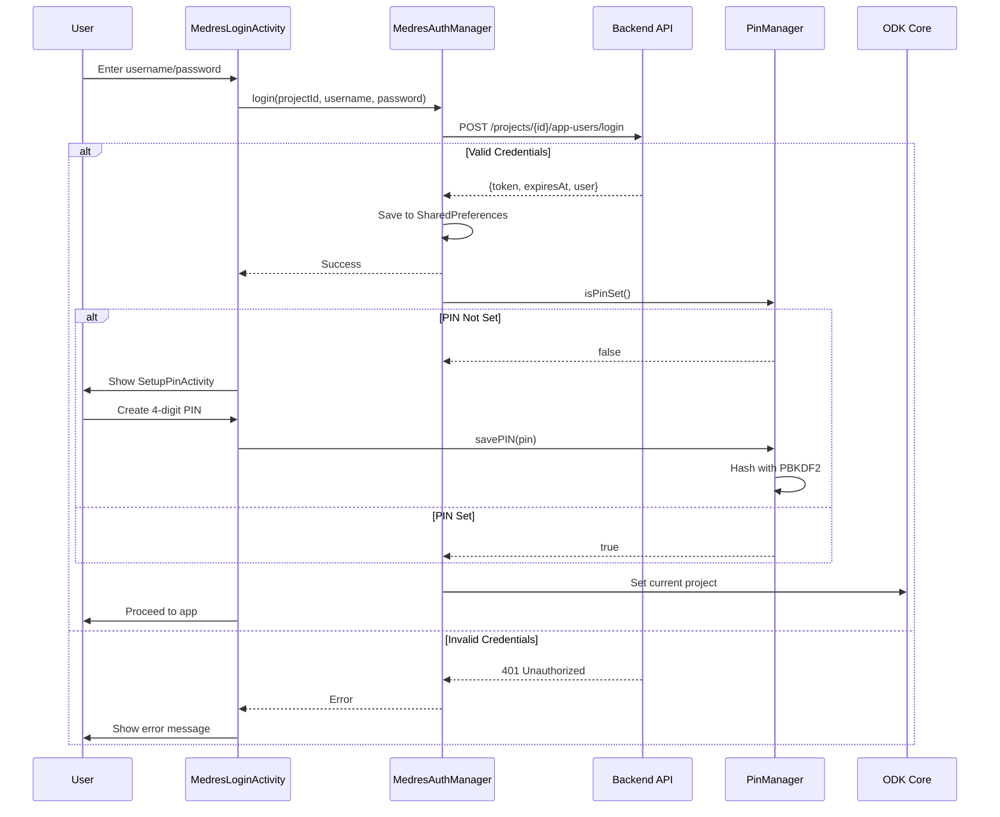
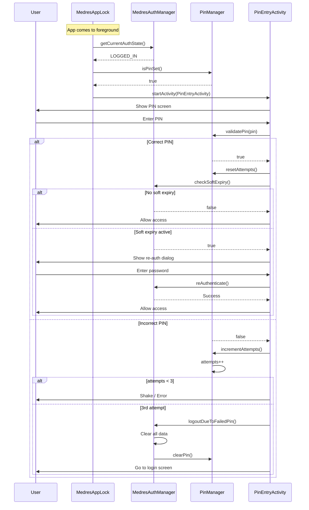
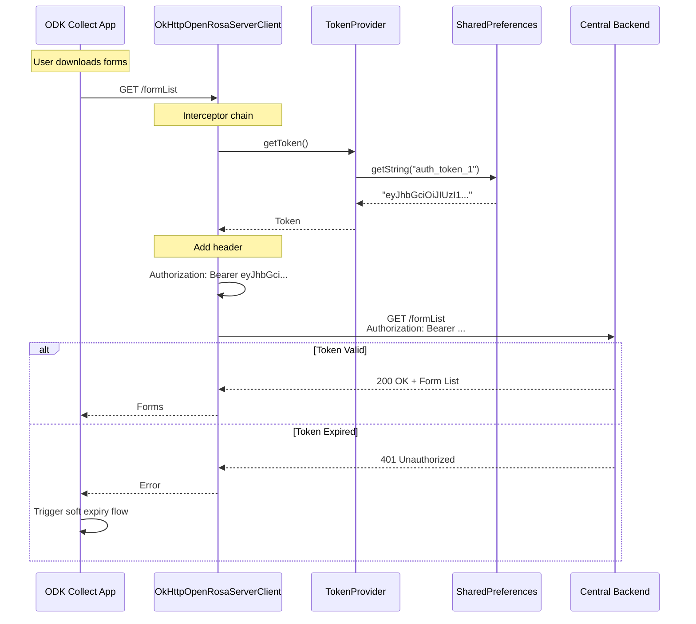
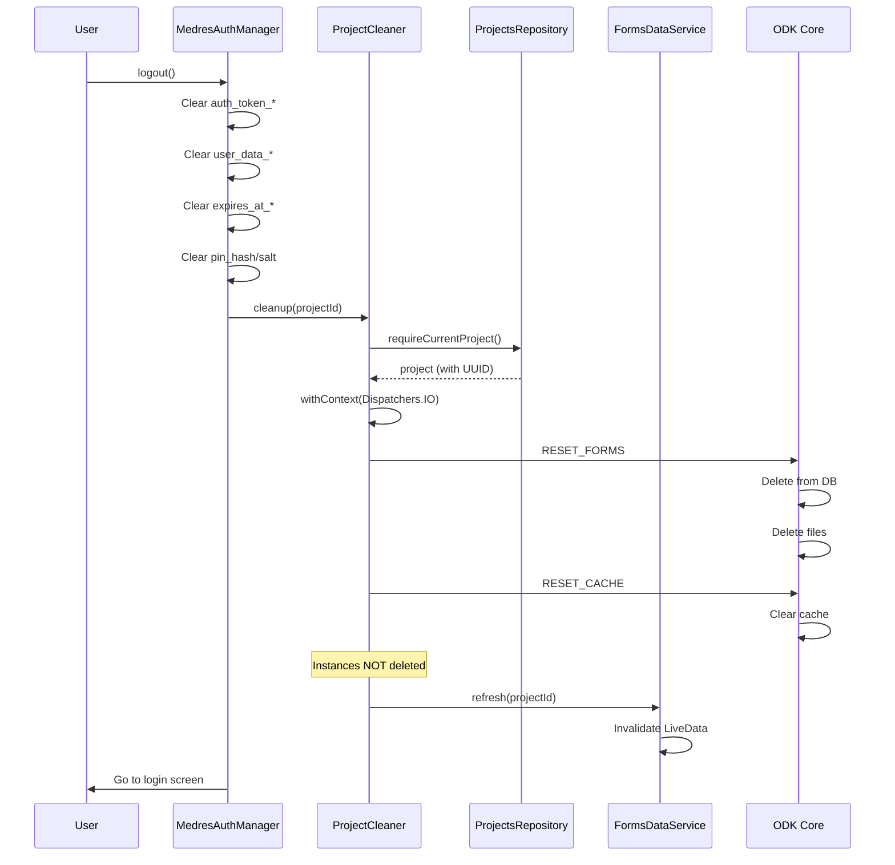
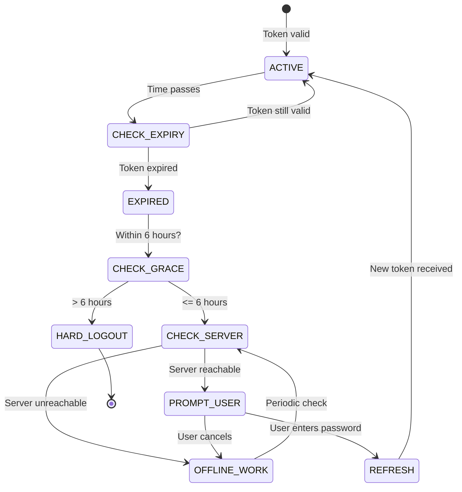
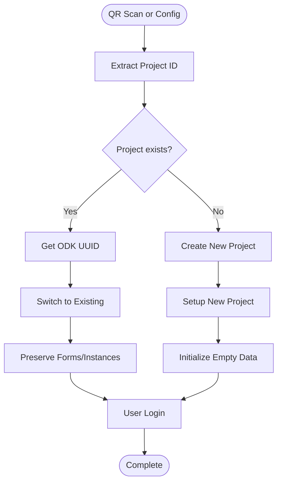
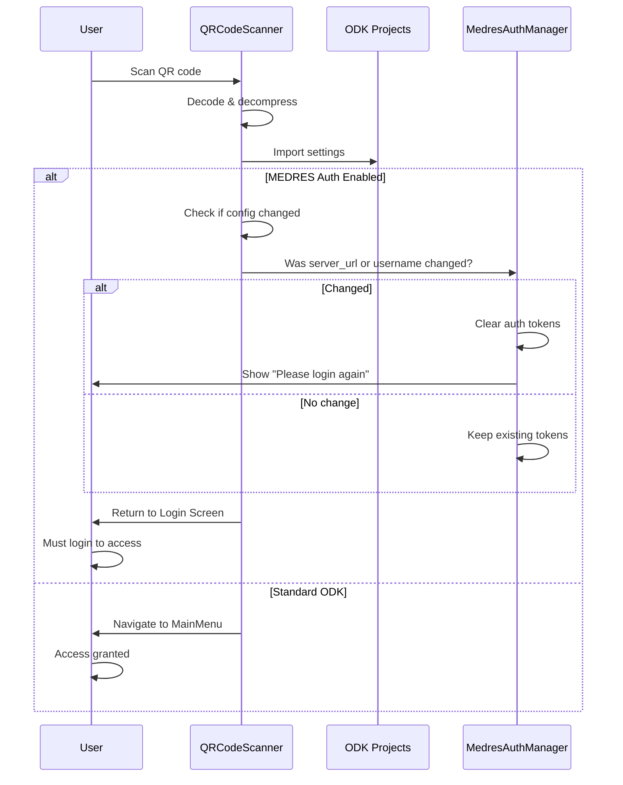

# Process Diagrams - MEDRES ODK Collect

> Last Updated: 2025-12-28
>
> **BPMN 2.0 Diagrams**: True BPMN 2.0 diagrams with proper notation are available in `bpmn/` folder.
>
> This document provides both Mermaid diagrams (for quick reference) and references to generated BPMN images.

## BPMN Diagrams (True BPMN 2.0 Notation)

Professional BPMN 2.0 diagrams with proper notation are located in `bpmn/output/`:

- **Login Authentication** - [login-authentication.png](bpmn/output/login-authentication.png) | [Source](bpmn/login-authentication.bpmn)
- **PIN Security** - [pin-security.png](bpmn/output/pin-security.png) | [Source](bpmn/pin-security.bpmn)
- **Token Lifecycle** - [token-lifecycle.png](bpmn/output/token-lifecycle.png) | [Source](bpmn/token-lifecycle.bpmn)
- **Data Isolation & Logout** - [data-isolation-logout.png](bpmn/output/data-isolation-logout.png) | [Source](bpmn/data-isolation-logout.bpmn)
- **Multi-User Persistence** - [multiuser-persistence.png](bpmn/output/multiuser-persistence.png) | [Source](bpmn/multiuser-persistence.bpmn)
- **QR Workflow** - [qr-workflow.png](bpmn/output/qr-workflow.png) | [Source](bpmn/qr-workflow.bpmn)

**To regenerate diagrams**: `cd bpmn && ./render.sh`

---

## Mermaid Diagrams (Quick Reference)

For quick reference, Mermaid diagrams are provided below. These render in GitHub and other Mermaid-compatible viewers.

### 1. Authentication State Machine
 
 > [!NOTE]
 > For the **Telemetry 401 Interceptor Flow**, please refer to the specific sequence diagram in [Authentication Architecture](authentication.md#2-401-interceptor-flow-medres-apis-only).
 
 ```mermaid
stateDiagram-v2
    [*] --> LOGGED_OUT

    LOGGED_OUT --> LOGGED_IN: User logs in successfully

    state LOGGED_IN {
        [*] --> ACTIVE
        ACTIVE --> GRACE_PERIOD: Token expires

        state GRACE_PERIOD {
            [*] --> CHECKING
            CHECKING --> OFFLINE: Server unreachable
            CHECKING --> SOFT_EXPIRY: Server reachable

            OFFLINE --> CHECKING: Periodic check
            SOFT_EXPIRY --> RE_AUTHENTICATED: User re-enters password
            SOFT_EXPIRY --> OFFLINE: User cancels
        }

        GRACE_PERIOD --> LOGGED_OUT: Hard deadline (>6 hours)
    }

    LOGGED_IN --> LOGGED_OUT: User logs out
    LOGGED_IN --> LOGGED_OUT: 3 failed PIN attempts
```

---

## 2. Complete Login Flow (Sequence Diagram)



---

## 3. PIN Security Flow (Sequence Diagram)



---

## 4. Token Injection Flow (Sequence Diagram)



---

## 5. Data Isolation & Logout (Sequence Diagram)



---

## 6. Grace Period Flow (State Diagram)



---

## 7. Multi-User Persistence (Flowchart)



---

## 8. QR Code Configuration (Sequence Diagram)



---

## Diagram Types Used

| Diagram Type | Purpose | Usage |
|--------------|---------|-------|
| **State Diagram** | Show states and transitions | Authentication lifecycle, grace periods |
| **Sequence Diagram** | Show component interactions | Login, PIN, token injection, logout |
| **Flowchart** | Show general process flow | Multi-user persistence, QR config |

---

## Related Documentation

- [MEDRES vs. Standard Boundaries](medres_vs_standard_boundary.md) - Architecture boundaries
- [Collect Telemetry](Collect_telemetry.md) - Telemetry system design
- [Authentication System](authentication.md) - Detailed auth documentation
- [PIN Security Feature](../05-FEATURES/pin-security.md) - PIN implementation
- [Data Isolation](data-isolation.md) - Storage and cleanup
