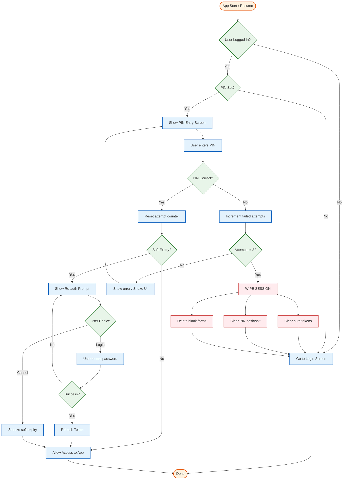
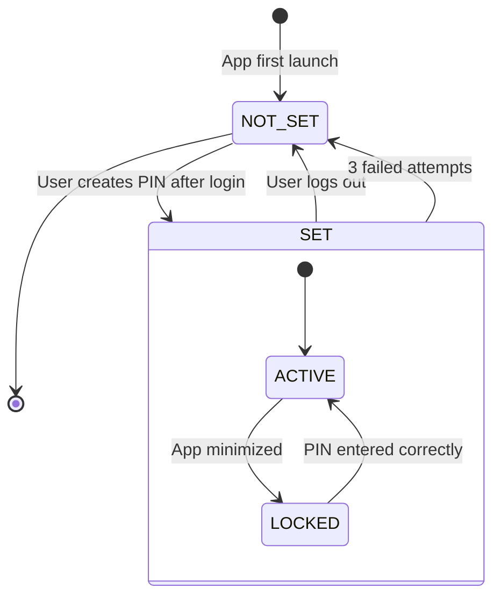
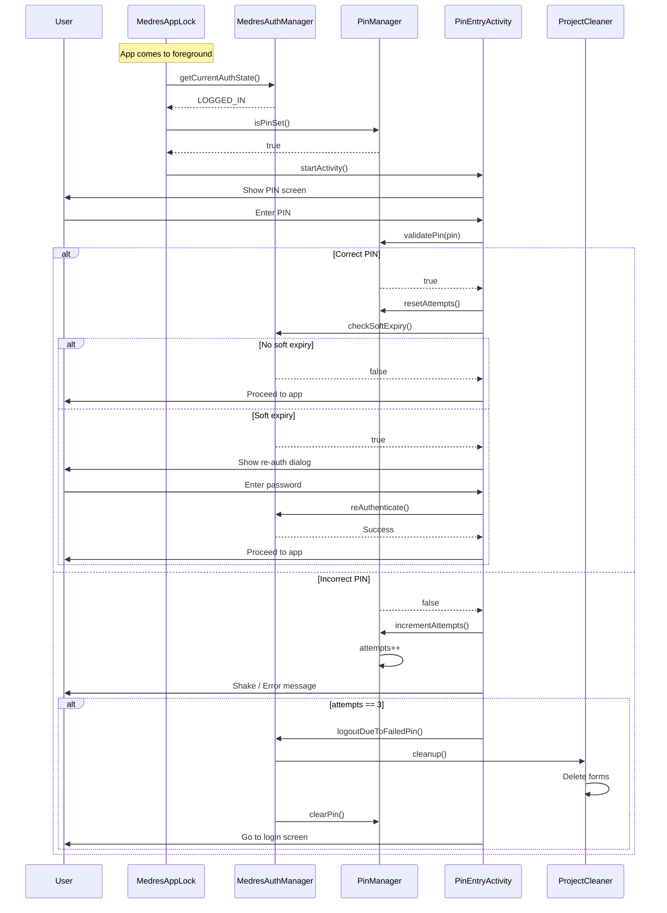

# PIN Security System - MEDRES ODK Collect

> Last Updated: 2025-12-28

This document details the PIN security implementation in MEDRES ODK Collect.

---

## Overview

The MEDRES fork implements a mandatory 4-digit PIN security layer on top of server authentication:

- **4-digit PIN** required after login
- **App lock** on resume (background detection)
- **3 failed attempts** = immediate session wipe
- **PBKDF2 hashing** for secure storage
- **Auto-lock** when app minimized

---

## BPMN: PIN Security Process



---

## PIN Lifecycle State Machine



---

## PIN Entry Flow (BPMN)



---

## Implementation Components

### MedresAppLock

**Purpose**: Monitors app lifecycle and triggers PIN screen

**Location**: `medres_auth_module/.../utils/MedresAppLock.kt`

**Key Methods**:
- `onActivityStarted()`: Called when any activity starts
- `onActivityStopped()`: Tracks background transition
- `shouldShowPinScreen()`: Determines if PIN is needed

### PinManager

**Purpose**: Manages PIN storage, validation, and attempts

**Location**: `medres_auth_module/.../utils/PinManager.kt`

**Key Methods**:
- `isPinSet()`: Checks if PIN exists
- `validatePin(pin)`: Validates entered PIN
- `savePin(pin)`: Hashes and stores new PIN
- `clearPin()`: Removes PIN on logout
- `getAttempts()` / `resetAttempts()`: Failed attempt tracking

### PinEntryActivity

**Purpose**: UI for PIN entry

**Location**: `medres_auth_module/.../activities/PinEntryActivity.kt`

**Key Features**:
- 4-digit input only
- Shake animation on error
- Shows remaining token time
- "Refresh Token" button
- Cannot be bypassed via Back button

### SetupPinActivity

**Purpose**: Initial PIN setup

**Location**: `medres_auth_module/.../activities/SetupPinActivity.kt`

**Key Features**:
- PIN entry + confirmation
- Validation (4 digits)
- Redirected to from login if PIN not set

### ChangePinActivity

**Purpose**: PIN change flow

**Location**: `medres_auth_module/.../activities/ChangePinActivity.kt`

**Key Features**:
- Requires current PIN
- New PIN entry + confirmation
- Accessed from Settings

---

## Security Properties

### PIN Storage

| Property | Implementation |
|----------|----------------|
| Algorithm | PBKDF2WithHmacSHA1 |
| Iterations | 10,000 |
| Salt | Random per PIN |
| Storage | Private SharedPreferences |

### Failed Attempt Policy

| Attempts | Action |
|----------|--------|
| 1 | Error message, allow retry |
| 2 | Error message, allow retry |
| 3 | **Immediate wipe** - clear all data |

### Wipe on 3 Failures

When PIN is entered incorrectly 3 times:

1. **Clear auth tokens** - `auth_token_{projectId}` removed
2. **Clear PIN** - `pin_hash` and `pin_salt` removed
3. **Delete forms** - Blank forms deleted via `ProjectCleaner`
4. **Return to login** - User must log in again

---

## Data Structures

### SharedPreferences: PIN Keys

| Key | Type | Description |
|-----|------|-------------|
| `pin_hash` | String | PBKDF2 hash of PIN |
| `pin_salt` | String | Salt used for hashing |
| `pin_attempts` | Int | Failed attempt counter |
| `pin_updated_at` | Long | Timestamp of last PIN change |

---

## Configuration

### Disable PIN (Not Recommended)

To disable PIN enforcement (for testing only):

```kotlin
// In MedresAppLock.kt
private fun shouldShowPinScreen(): Boolean {
    return false // Disable PIN
}
```

### Change Attempt Limit

```kotlin
// In PinManager.kt
companion object {
    private const val MAX_ATTEMPTS = 5 // Default 3
}
```

---

## Testing Checklist

- [ ] PIN required after first login
- [ ] PIN required on app resume
- [ ] Correct PIN allows access
- [ ] Incorrect PIN shows error
- [ ] 3rd failed attempt triggers logout
- [ ] Forms are deleted after wipe
- [ ] Back button doesn't bypass PIN
- [ ] PIN screen shows token expiry
- [ ] "Refresh Token" works from PIN screen
- [ ] Change PIN flow works correctly

---

## Troubleshooting

### Issue: PIN Not Required on Resume

**Cause**: `MedresAppLock` not registered

**Solution**: Check `Collect.onCreate()` for:
```kotlin
registerActivityLifecycleCallbacks(MedresAppLock())
```

### Issue: Wipe Not Triggered

**Cause**: Attempt counter not incrementing

**Solution**: Check `PinManager.incrementAttempts()` is called

### Issue: Forms Persist After Wipe

**Cause**: `ProjectCleaner` not triggered

**Solution**: Ensure `logoutDueToFailedPin()` calls cleaner

---

## Related Documentation

- [Architecture Overview](../01-ARCHITECTURE/overview.md) - System architecture
- [Authentication System](../01-ARCHITECTURE/authentication.md) - Auth flows
- [Activities Reference](../01-ARCHITECTURE/activities.md) - Activity details
- [Debugging Guide](../02-DEVELOPMENT/debugging.md) - Debugging tips
